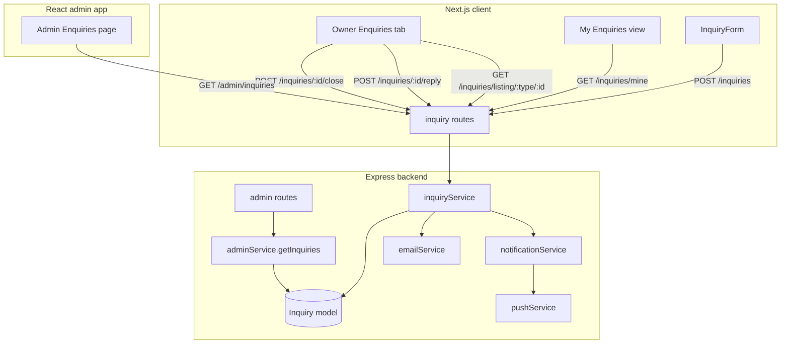
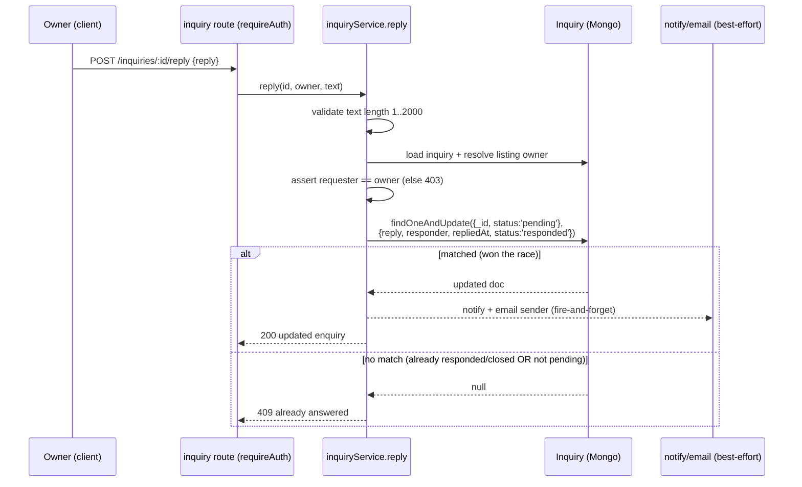
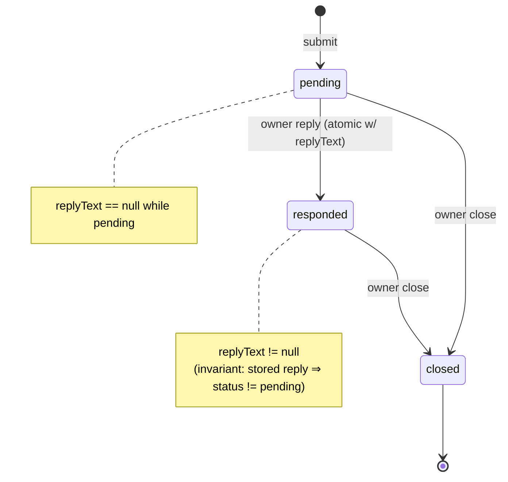

# Design — Event/Venue Enquiries with Owner Reply

## Overview

This feature turns the existing one-way "Ask a Question" inquiry into a
**structured, sign-in-gated, single-reply enquiry system** for events and venues.
It is built by **extending the existing `Inquiry` model and services** rather than
introducing a parallel model or depending on the `Conversation`/`Message` chat
system.

The design is deliberately conservative (per the workspace `ponytail.md` ladder):
it reuses the `Inquiry` model, `inquiryService`, `notificationService`,
`emailService`, the `requireAuth`/`adminAuth` middleware, the existing atomic
`findOneAndUpdate` concurrency pattern, and the existing route-mount table. The
net new surface is: a handful of reply/close/list endpoints, four new schema
fields, an owner "Enquiries" tab, a sender "My Enquiries" view, an admin list, and
a rewiring of the client `InquiryForm` submit path.

### What changes vs. today

| Area | Today | After this feature |
|------|-------|--------------------|
| Submit auth | `optionalAuth` (guests allowed) | `requireAuth` (sign-in required) |
| Sender identity | Typed into the form | Captured from the authenticated account |
| Owner reply | No in-app path | Single reply per enquiry, owner-only |
| Status | `pending` set, never transitioned | `pending → responded → closed` lifecycle |
| Sender view | None | "My Enquiries" dashboard view |
| Owner view | None | "Enquiries" tab on each listing's manage page |
| Admin view | None | Platform-wide admin list |
| Submit → chat | Always opens inquiry→chat conversation | Chat bridge used only as a degraded fallback |
| Brand enquiry chat | `start-brand-enquiry` | Unchanged |

### Non-goals

- Multi-message threads (this is single-reply, not chat).
- Changing the brand/creator `start-brand-enquiry` behavior.
- Removing the `start-inquiry-conversation` endpoint (it is retained purely as the
  degraded fallback path per Requirement 11.1).

## Architecture

The system spans the three existing apps. The backend owns all trust-boundary
enforcement (auth, ownership, validation, rate limiting, atomicity); the clients
are thin.



### Request lifecycle: owner reply (the correctness-critical path)



The single conditional `findOneAndUpdate({ _id, status: 'pending' }, …)` is the
whole concurrency story. It mirrors the seat-sale pattern already in
`ticketService` (`Event.findOneAndUpdate` guarded by remaining capacity) and the
discount-usage pattern in `discountService`. Because the write and the status flip
happen in one atomic document update, a stored reply always implies a non-`pending`
status, and two racing replies can match at most once. No multi-document
transaction is required, which matches how the rest of this codebase handles
single-document invariants.

### Layering

- **Route layer** (`routes/inquiry.js`, `routes/admin.js`): auth gating, request
  shape, HTTP status mapping. No business logic.
- **Service layer** (`inquiryService`, `adminService`): validation, ownership
  resolution, atomic writes, best-effort notification orchestration. This is where
  correctness properties are tested.
- **Model layer** (`Inquiry`): schema, enums, indexes, the reply fields.

## Components and Interfaces

### Backend endpoints

All mount under both `/api/v1/inquiries` and `/api/inquiries` via the existing
route table (no new registration needed beyond what's already there). Admin
endpoints mount under the existing `/api/admin` router (already gated by
`adminAuth` via `router.use`).

| Method & path | Auth | Purpose | Key errors |
|---------------|------|---------|-----------|
| `POST /inquiries` | `requireAuth` | Submit an enquiry (identity from account) | 400 unavailable, 429 rate-limited |
| `GET /inquiries/mine` | `requireAuth` | Sender's own enquiries, newest first | — |
| `POST /inquiries/:id/seen` | `requireAuth` | Sender marks a reply seen | 403 not sender |
| `GET /inquiries/listing/:refType/:refId` | `requireAuth` | Owner's enquiries for one listing (+ pending count, status filter) | 403 not owner |
| `POST /inquiries/:id/reply` | `requireAuth` | Owner replies once | 403 not owner, 409 already answered |
| `POST /inquiries/:id/close` | `requireAuth` | Owner closes enquiry | 403 not owner, 409 invalid transition |
| `GET /admin/inquiries` | `adminAuth` | Platform-wide list (filter + paginate) | 401/403 non-admin |

Notes:
- The submit route changes from `optionalAuth` to `requireAuth` (Requirement 1.2).
  The sign-in redirect / return-URL preservation is handled client-side before the
  request is made.
- `senderName`/`senderEmail` are **derived server-side** from `req.user`, not read
  from the request body (Requirements 1.5, 10.4). The body carries only
  `referenceType`, `referenceId`, `message`.

### `inquiryService` (extended)

```
submitInquiry({ referenceType, referenceId, message, user })  // reused + hardened
  → validates reference status, enforces rate limit, creates pending Inquiry,
    best-effort owner notify + email. Now requires an authenticated `user`
    and derives senderName/senderEmail from it.

replyToInquiry({ inquiryId, responder, replyText })            // new
  → validates length 1..2000, resolves listing owner, asserts responder === owner,
    atomic findOneAndUpdate guarded on status:'pending', best-effort sender
    notify + email. Returns updated enquiry or throws 403/409.

closeInquiry({ inquiryId, requester })                         // new
  → asserts requester === owner, atomic transition to 'closed' guarded on
    status in ['pending','responded']. Rejects closed→* transitions (409).

getOwnerInquiries({ requester, referenceType, referenceId, statusFilter })  // new
  → asserts requester owns the listing (else 403), returns enquiries newest-first
    + pending count. Never returns [] in place of an authorization error.

getSenderInquiries({ userId })                                 // new
  → returns the caller's own enquiries newest-first, normalized (see 10.2).

markReplySeen({ inquiryId, requester })                        // new
  → asserts requester is the sender, sets senderSeenReply = true (idempotent).

normalizeStatus(inquiry)                                       // new (pure)
  → if no replyText, presents status as 'pending' regardless of stored value
    (Requirement 10.2). Applied on every read path.
```

Ownership resolution reuses the existing logic already present in
`start-inquiry-conversation`: `event → organizer`, `venue → owner`.

### Frontend components (Next.js client)

- **`InquiryForm`** (rewired): drop the manual name/email/phone inputs and the
  post-submit `startInquiryConversation` call. If unauthenticated, prompt sign-in
  with return URL. Submit `{ referenceType, referenceId, message }`. On the normal
  path it does **not** open a chat (Requirement 11.2); only if the enquiry endpoint
  is unreachable does it fall back to `startInquiryConversation` (Requirement 11.1).
- **`EnquiriesTab`** (new): rendered on the event manage page
  (`/dashboard/events/[id]`) and the venue manage page. Lists enquiries, shows
  pending count, status filter (`pending`/`responded`/`closed`/all), a reply
  composer (1–2000 chars with live counter) for `pending` enquiries, read-only
  reply display otherwise, and a "Mark closed" action.
- **`MyEnquiries` view** (new): `/dashboard/enquiries`, lists the sender's
  enquiries with listing name/type, message, status, and the owner reply when
  present. Opening an enquiry with an unseen reply calls `/inquiries/:id/seen`.
- **`inquiriesApi`** (extended in `client/src/lib/api.ts`): `submit` (body slimmed
  to message + reference), `listMine`, `listForListing`, `reply`, `close`,
  `markSeen`.

### Admin app (React)

- **Admin Enquiries page** (new, follows the existing `Events.jsx`/`Venues.jsx`
  list pattern): calls `GET /admin/inquiries` with status/reference-type filters
  and pagination, shows sender, listing, message, reply, status, timestamps.

## Data Models

### `Inquiry` schema extensions

Four new fields are added; existing fields are unchanged so existing records keep
working (Requirement 10.1, 10.2).

```js
// Added to inquirySchema:
replyText:      { type: String, minlength: 1, maxlength: 2000, default: null },
responder:      { type: mongoose.Schema.Types.ObjectId, ref: 'User', default: null },
repliedAt:      { type: Date, default: null },
senderSeenReply:{ type: Boolean, default: false },
```

The `replyText` field is **authoritative** for whether an enquiry has been
answered (Requirement 10.2). A read-side `normalizeStatus` helper presents any
enquiry lacking `replyText` as `pending`, auto-correcting an inconsistent stored
`responded`/`closed`. Existing status enum (`pending`/`responded`/`closed`),
`senderName`, `senderEmail`, `user`, `message`, and reference fields are retained.

### Indexes

Two reads dominate (Requirement 10.3):

```js
inquirySchema.index({ user: 1, createdAt: -1 });                 // My Enquiries
inquirySchema.index({ referenceType: 1, referenceId: 1, createdAt: -1 }); // Owner view
```

The existing `{ referenceId, senderEmail, createdAt }` index continues to serve
the rate-limit count query. `{ referenceType, status }` is retained for admin
filtering.

### Status lifecycle



Invalid transitions (e.g. `closed → pending`, `responded → pending`, any
sender-initiated status change) are rejected server-side (Requirements 8.4, 12.3).

## Correctness Properties

*A property is a characteristic or behavior that should hold true across all valid
executions of a system — essentially, a formal statement about what the system
should do. Properties serve as the bridge between human-readable specifications and
machine-verifiable correctness guarantees.*

The reply/close/validation/rate-limit logic in `inquiryService` is pure business
logic over an in-memory/mocked data store with a large, meaningful input space
(varying message lengths, statuses, owner vs. non-owner requesters, concurrent
replies). That makes it a good fit for property-based testing. The React views and
admin list rendering are covered by example/snapshot tests instead (see Testing
Strategy).

### Property 1: Submitted enquiries are persisted as pending with account identity

*For any* authenticated user and any valid listing (event in `upcoming`/`approved`/
`ongoing`, or `approved` venue) and any message of length 10–2000, submitting an
enquiry SHALL persist exactly one `Inquiry` with `status = 'pending'`, `replyText =
null`, and `senderName`/`senderEmail` equal to the submitting account's identity.

**Validates: Requirements 1.3, 1.5, 8.1, 10.4**

### Property 2: Message length is validated at the boundary

*For any* message string, submission SHALL be accepted if and only if its length is
between 10 and 2000 characters inclusive; rejected submissions leave the enquiry
count unchanged.

**Validates: Requirements 1.4, 12.4**

### Property 3: Unavailable references are rejected

*For any* referenced event not in (`upcoming`/`approved`/`ongoing`) or venue not
`approved`, submission SHALL be rejected with an "unavailable" error and no
`Inquiry` is created.

**Validates: Requirements 1.6, 12.4**

### Property 4: Rate limit caps enquiries per sender per listing

*For any* sender and listing, at most 5 enquiries SHALL be accepted within any
rolling 24-hour window; the 6th within the window is rejected with 429, and
enquiries outside the window do not count toward the limit.

**Validates: Requirements 2.1, 2.2, 2.3**

### Property 5: Persistence survives notification/email failure

*For any* submission or reply, if any or all notification and email deliveries
fail, the enquiry (respectively the reply and its status transition) SHALL still be
persisted.

**Validates: Requirements 3.5, 6.5, 12.1**

### Property 6: Reply writes the response and transitions atomically

*For any* `pending` enquiry, a successful owner reply SHALL store `replyText`,
`responder`, `repliedAt`, and set `status = 'responded'` together, such that a
stored reply always implies `status != 'pending'`.

**Validates: Requirements 5.1, 5.5, 8.2, 12.1**

### Property 7: Single-reply invariant under concurrency

*For any* enquiry and any two concurrent reply attempts, at most one SHALL succeed;
the other is rejected, and the stored reply is the one that won.

**Validates: Requirements 5.4, 12.2**

### Property 8: Reply length is validated at the boundary

*For any* reply string, a reply SHALL be accepted if and only if its length is
between 1 and 2000 characters inclusive.

**Validates: Requirements 5.2, 12.4**

### Property 9: Only the listing owner may reply, close, or view listing enquiries

*For any* enquiry and any requester who is not the listing's owner, reply, close,
and owner-list operations SHALL be rejected with an authorization error (never a
silent empty result), independent of client input.

**Validates: Requirements 4.4, 5.3, 12.3**

### Property 10: Status transitions are restricted to the valid graph

*For any* enquiry and any transition, the system SHALL permit only `pending →
responded`, `pending → closed`, and `responded → closed`, and SHALL reject all
others (including any sender-initiated change).

**Validates: Requirements 8.3, 8.4, 12.3**

### Property 11: Owner and sender list views are correctly scoped and ordered

*For any* set of enquiries, `getOwnerInquiries` SHALL return exactly the enquiries
whose listing the requester owns, and `getSenderInquiries` SHALL return exactly the
enquiries whose `user` is the requester — both ordered most-recent-first.

**Validates: Requirements 4.2, 7.1, 7.3**

### Property 12: Reply content is authoritative over stored status

*For any* enquiry with `replyText == null`, every read path SHALL present it as
`pending` regardless of the stored status value.

**Validates: Requirements 10.2**

### Property 13: Marking a reply seen is idempotent

*For any* enquiry with a reply, the sender marking it seen SHALL set
`senderSeenReply = true`, and applying the operation again SHALL leave the state
unchanged.

**Validates: Requirements 7.4**

## Error Handling

- **Validation errors** (message/reply length, missing fields): 400 with a
  field-level message the client surfaces inside the form.
- **Reference unavailable** (bad status / not found): 400 "unavailable" (existing
  behavior in `submitInquiry`).
- **Rate limit exceeded**: 429 with limit + retry guidance (existing behavior).
- **Authorization** (non-owner action, non-admin admin endpoint): 403. Ownership
  is always resolved and checked server-side before any mutation, never inferred
  from client-supplied ownership claims (Requirements 4.4, 5.3, 12.3). The admin
  router is already gated wholesale by `adminAuth` via `router.use`.
- **Single-reply conflict** (`findOneAndUpdate` matched nothing because the enquiry
  is no longer `pending`): 409 "already answered", with the existing reply returned
  so the UI can show it read-only (Requirement 5.4).
- **Invalid status transition** (e.g. `closed → *`): 409.
- **Notification/email failures**: caught and logged, never propagated — delivery
  is best-effort and never blocks persistence (Requirements 3.5, 6.5). This reuses
  the existing try/catch-and-log pattern in `submitInquiry` and the fire-and-forget
  `dispatchPush` in `notificationService`.
- **Migration fallback**: if the client's enquiry submit fails as *unreachable*
  (network/endpoint error, not a 4xx business rejection), the client MAY fall back
  to `startInquiryConversation` so the sender still reaches the owner (Requirement
  11.1). A 400/429 is a definitive rejection and does **not** trigger fallback.

## Testing Strategy

### Dual approach

- **Property-based tests** (backend, `inquiryService`): the 13 properties above.
  This codebase already runs property tests in `server/__tests__/*.property.test.ts`
  (e.g. `inquiryConversation.property.test.ts`), so the harness and generators
  pattern already exist and will be reused.
- **Unit / example tests**: specific edge cases and error mappings — empty message,
  exactly 10 / exactly 2000 char boundaries, reply on an already-closed enquiry,
  non-admin hitting `/admin/inquiries`, notification-failure path.
- **Component / snapshot tests** (client + admin): `EnquiriesTab`, `MyEnquiries`,
  the admin list, and the rewired `InquiryForm` (sign-in gate, no-chat-on-success,
  fallback-on-unreachable). These are UI-rendering concerns and are **not**
  property-tested.

### Property test configuration

- A property-based testing library appropriate for the backend TS/JS test setup
  will be used (the existing `*.property.test.ts` files already establish the
  library and runner — reuse it; do not hand-roll generators or a PBT framework).
- Each property test runs a **minimum of 100 iterations**.
- Each property test is implemented as a **single** property-based test and tagged
  with a comment referencing its design property, in the format:
  **Feature: event-venue-enquiries, Property {number}: {property_text}**
- Concurrency (Property 7) is exercised by issuing two `replyToInquiry` calls and
  asserting exactly one success; the atomic `findOneAndUpdate({_id, status:'pending'})`
  guarantee is what makes this pass without a transaction.

### Migration safety checks (Requirement 11.4)

- Example tests assert that `start-brand-enquiry` behavior is untouched and that
  existing brand conversations / the messages inbox still resolve. The
  `start-inquiry-conversation` endpoint is retained (fallback only), so existing
  inquiry conversations are not broken.
