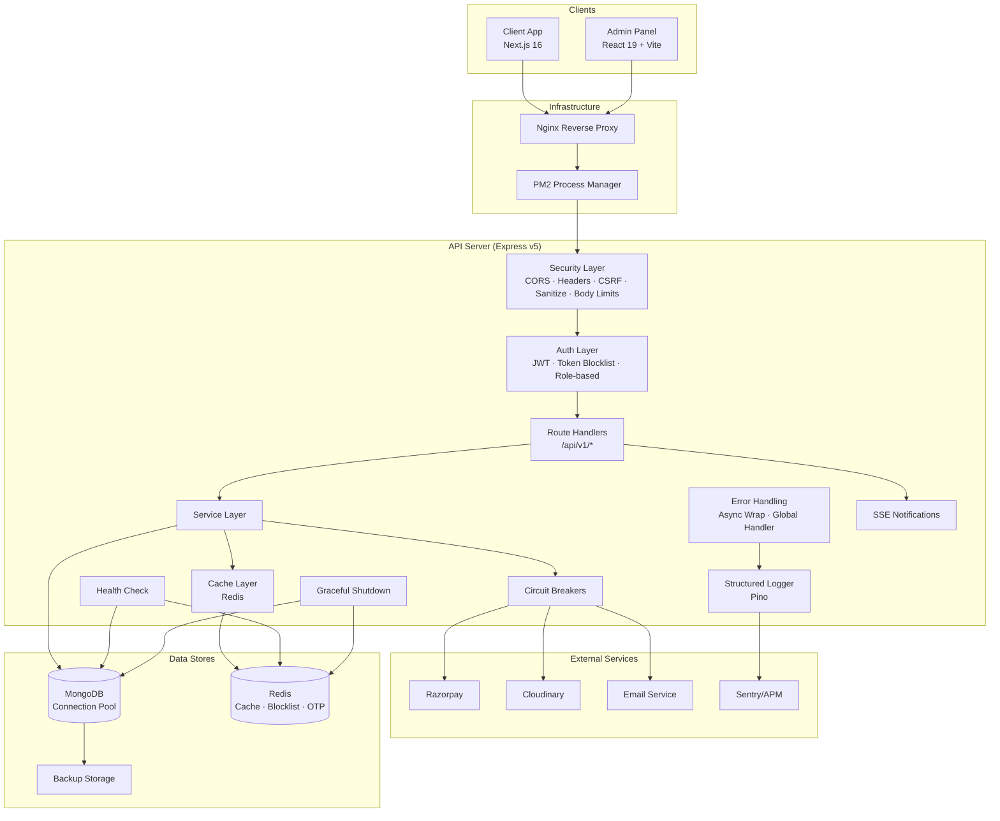
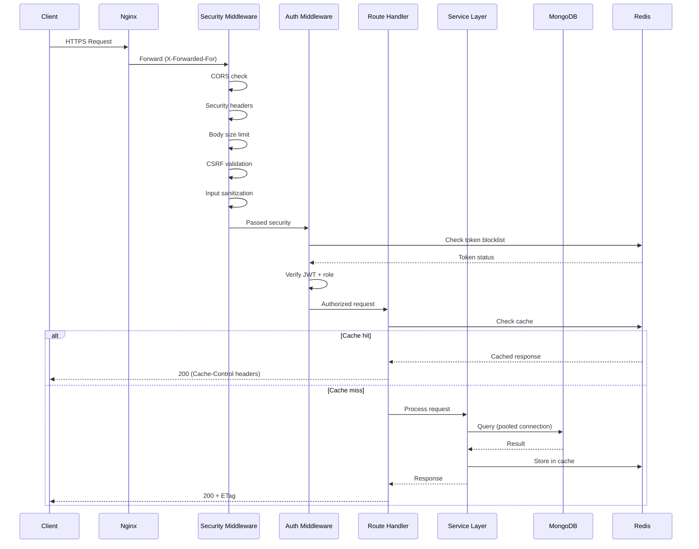

# Design Document: Industry-Standard Upgrade

## Overview

This design covers the comprehensive upgrade of the FIRA platform from prototype-grade to production quality across three applications:

- **API Server** (`/server`): Express.js v5, Node.js, MongoDB via Mongoose, deployed on EC2 with PM2
- **Client App** (`/client`): Next.js 16 with App Router, TypeScript, React 19
- **Admin Panel** (`/admin`): React 19 + Vite (rolldown-vite), JavaScript

The upgrade spans 8 domains: Security, Testing, Error Handling, Resilience & Performance, Accessibility, Architecture & Code Quality, Operations, and Design & DX. The design prioritizes changes that can be layered incrementally — middleware additions, configuration changes, and additive modules — so that the running system is never left in a broken intermediate state.

### Design Principles

1. **Middleware-first**: Security, sanitization, logging, and error handling are implemented as Express middleware, applied once at the app level.
2. **Configuration-driven**: Thresholds (pool sizes, TTLs, rate limits) live in environment variables with sensible defaults.
3. **Additive layering**: Each domain can ship independently. No domain blocks another.
4. **Ponytail-compliant**: Reuse existing patterns (the rate limiter is already middleware), use the libraries already installed where possible, and add the minimum new dependencies needed.

---

## Architecture

### High-Level System Diagram



### Request Flow (Security-Hardened)



---

## Components and Interfaces

### Domain 1: Security (Requirements 1–10)

#### 1.1 CORS Middleware (`server/middleware/cors.js`)

Replaces the current `app.use(cors())` with a configured allowlist:

```typescript
interface CorsConfig {
  allowedOrigins: string[];  // from CORS_ALLOWED_ORIGINS env var
}
```

- Reads `CORS_ALLOWED_ORIGINS` at startup; refuses to start if missing/empty.
- Returns 403 (no CORS headers) for disallowed origins.
- Responds to preflight OPTIONS within 200ms.
- Per-environment allowlists via environment-specific `.env` files.

#### 1.2 Security Headers Middleware (`server/middleware/securityHeaders.js`)

Uses the `helmet` package (new dependency) configured with:

| Header | Value |
|--------|-------|
| Content-Security-Policy | `default-src 'self'; script-src 'self' ${CSP_TRUSTED_CDNS}` |
| Strict-Transport-Security | `max-age=31536000; includeSubDomains; preload` |
| X-Frame-Options | `DENY` |
| X-Content-Type-Options | `nosniff` |
| Referrer-Policy | `strict-origin-when-cross-origin` |
| X-DNS-Prefetch-Control | `off` |
| X-Download-Options | `noopen` |

Applied to every response including errors and `/health`.

#### 1.3 Unified Auth Middleware (`server/middleware/auth.ts`)

Consolidates `auth.js`, `adminAuth.js`, `venueOwnerAuth.js` into a single parameterized middleware:

```typescript
function requireAuth(...roles: ('user' | 'venueOwner' | 'admin')[]): RequestHandler;
```

- Validates JWT signature and expiration.
- Checks token against Redis blocklist (5ms p95 lookup).
- If Redis is down → 503 (fail closed).
- Role check: 403 if user lacks required role.
- All payment routes require `requireAuth('user')` minimum; payout/refund processing requires `requireAuth('admin')`.

#### 1.4 Token Blocklist (`server/services/tokenBlocklist.ts`)

- Stored in Redis with TTL = token's remaining `exp` time.
- Logout endpoint adds token `jti` to blocklist.
- Auth middleware checks blocklist on every request.
- Automatic expiration via Redis TTL (no cleanup job needed).

#### 1.5 Body Size Limits

Replace `express.json({ limit: '50mb' })` with:

```javascript
app.use(express.json({ limit: '1mb' }));
app.use(express.urlencoded({ extended: true, limit: '1mb' }));
// Upload routes get their own limit via multer config (10MB)
```

Returns 413 on violation.

#### 1.6 Input Sanitization Middleware (`server/middleware/sanitize.ts`)

- Strips/rejects any key starting with `$` (NoSQL injection prevention).
- Applied as global middleware before route handlers.
- Returns 400 with descriptive error on violation.
- Schema validation via `zod` (new dependency) on route-specific schemas.

#### 1.7 Field-Level Encryption (`server/services/encryption.ts`)

```typescript
interface EncryptionService {
  encrypt(plaintext: string): { ciphertext: string; iv: string; tag: string };
  decrypt(encrypted: { ciphertext: string; iv: string; tag: string }): string;
  mask(value: string): string;  // returns "****1234"
}
```

- AES-256-GCM via Node.js `crypto` module (no new dependency).
- Unique IV per operation.
- `ENCRYPTION_KEY` env var: 32 bytes, validated at startup.
- Applied to bank details and government IDs before DB write.

#### 1.8 Log Safety (`server/lib/logger.ts`)

Integrated into the structured logger (see Operations). Redaction rules:
- Fields: `password`, `token`, `refreshToken`, `secret`, `accountNumber`, `ifsc`, `pan`, `aadhaar`, `Authorization`.
- JWT pattern (`eyJ...`) → `[TOKEN_REDACTED]`.
- Production: no request body logging. Dev: body logging only if `LOG_REQUEST_BODY=true`, truncated to 500 chars.

#### 1.9 Admin Credential Removal

- Remove hardcoded credentials from `admin/src/pages/Login.jsx`.
- Gate dev-mode hints behind `import.meta.env.VITE_DEV_MODE === 'true'`.
- Vite tree-shakes the dev block out of production builds.

#### 1.10 CSRF Protection (`server/middleware/csrf.ts`)

- Token issued via `Set-Cookie` (HttpOnly, SameSite=Strict, Secure).
- 32 random bytes via `crypto.randomBytes`.
- Validated on POST/PUT/DELETE/PATCH when request has Cookie header or matching Origin/Referer.
- Skipped for pure bearer-token API clients (no Cookie, no matching Origin).

---

### Domain 2: Testing (Requirements 11–14)

#### 2.1 Server Testing Stack

| Tool | Purpose |
|------|---------|
| Vitest | Test runner + coverage |
| supertest | HTTP integration tests |
| mongodb-memory-server | In-memory test DB |

- `npm test` in `/server` runs Vitest with coverage enforcement (60% line minimum).
- Each route file gets ≥1 integration test (2xx + 4xx).
- Each service function gets ≥1 unit test (success + failure).

#### 2.2 Client Testing Stack

| Tool | Purpose |
|------|---------|
| Vitest | Test runner + coverage |
| @testing-library/react | Component testing |
| happy-dom | DOM environment |

- `npm test` in `/client` runs Vitest with coverage (50% minimum).
- Component tests for all shared UI components.
- Hook and utility tests.

#### 2.3 E2E Testing

| Tool | Purpose |
|------|---------|
| Playwright | Cross-browser E2E |

- Three core journeys: registration, event booking, venue creation.
- Deterministic fixture data with reset before each suite.
- 5-minute timeout on CI.
- Screenshots + traces on failure.

#### 2.4 CI Gate (GitHub Actions)

```yaml
jobs:
  test:
    steps:
      - run: npm test          # server (fails on coverage < 60%)
      - run: npm test          # client (fails on coverage < 50%)
      - run: npm run lint      # both apps, no error suppression
      - run: check-debug-files # fails if testServer*.js etc. exist
  e2e:
    steps:
      - run: npx playwright test
```

---

### Domain 3: Error Handling (Requirements 15–18)

#### 3.1 Client Error Boundaries

```
src/app/
├── error.tsx              (global fallback)
├── events/error.tsx       (events segment)
├── venues/error.tsx       (venues segment)
├── dashboard/
│   └── bookings/error.tsx (bookings segment)
└── create/error.tsx       (create segment)
```

Each boundary: renders error message (no stack trace), retry button, logs to error tracking service.

#### 3.2 Admin Error Boundaries

```jsx
// Top-level: wraps Routes inside AdminDashboardLayout
<ErrorBoundary fallback={<AdminErrorFallback />}>
  <Routes>...</Routes>
</ErrorBoundary>

// Per-page: wraps each page content
<PageErrorBoundary>
  <Dashboard />
</PageErrorBoundary>
```

Sidebar remains functional when page boundary catches. Fallback includes retry + "Go to Dashboard" link.

#### 3.3 Async Error Wrapper (`server/middleware/asyncHandler.ts`)

```typescript
const asyncHandler = (fn: RequestHandler): RequestHandler =>
  (req, res, next) => Promise.resolve(fn(req, res, next)).catch(next);
```

- Applied to all async route handlers.
- Non-Error throws still produce 500 + reference ID.
- Process never crashes from unhandled rejections (global `unhandledRejection` handler logs + continues).

#### 3.4 Graceful Shutdown (`server/lib/shutdown.ts`)

On SIGTERM/SIGINT:
1. Stop accepting connections (server.close()).
2. Wait up to 30s for in-flight requests.
3. Close Redis (`client.quit()`).
4. Close MongoDB (`mongoose.disconnect()`).
5. Exit 0 on clean close, exit 1 if forced after 30s timeout.
6. Log warning with count of forcibly terminated requests.

---

### Domain 4: Resilience & Performance (Requirements 19–26)

#### 4.1 Circuit Breaker Module (`server/lib/circuitBreaker.ts`)

```typescript
interface CircuitBreakerConfig {
  name: string;
  failureThreshold: number;  // 5 for Razorpay/Cloudinary, 3 for email
  rollingWindowMs: number;   // 60000
  probeIntervalMs: number;   // 30000
}
```

Library: `opossum` (lightweight, battle-tested circuit breaker for Node.js).

States: closed → open (after threshold failures) → half-open (probe every 30s) → closed (on probe success).

Applied to: Razorpay, Cloudinary, email service calls. Returns 503 when open.

#### 4.2 Redis Integration (`server/config/redis.ts`)

New dependency: `ioredis` (already implicitly needed for OTP — currently stored in MongoDB).

```typescript
interface RedisUsage {
  otp: { key: `otp:${phone}`, ttl: 600 };
  tokenBlocklist: { key: `blocked:${jti}`, ttl: remainingExpSeconds };
  cache: { key: `cache:events:${queryHash}`, ttl: 300 };
}
```

Fallback: on Redis unavailability, direct MongoDB queries + rate-limited warning log (once/60s).

#### 4.3 HTTP Caching

- Public listings: `Cache-Control: public, max-age=60` + ETag (content hash).
- If-None-Match → 304 (no body).
- Authenticated endpoints: `Cache-Control: no-store`.
- Cache invalidation: on write operations, delete matching Redis cache entries.

#### 4.4 Connection Pooling

```javascript
mongoose.connect(MONGODB_URI, {
  minPoolSize: 10,
  maxPoolSize: 50,
  maxIdleTimeMS: 30000,
  connectTimeoutMS: 10000,
});
```

Pool utilization monitoring: log warning (once/60s) when active > 80% of max.

#### 4.5 N+1 Query Elimination

- Reminder job: single query with `.populate()` or aggregation pipeline per event.
- List endpoints: `$in` operator or aggregation with `$lookup` for related data.
- Maximum 2 DB round-trips per list endpoint regardless of N.

#### 4.6 SSE Notifications (`server/routes/notifications.ts`)

```
GET /api/v1/notifications/stream
Headers: Authorization: Bearer <token>
Content-Type: text/event-stream
```

- Authenticated endpoint.
- Heartbeat comment every 30s.
- Client reconnects with exponential backoff (1s → 60s max).
- Delivery within 2s of notification creation.

#### 4.7 Admin Code Splitting

```jsx
const Dashboard = React.lazy(() => import('./pages/Dashboard'));
const Events = React.lazy(() => import('./pages/Events'));
// ... all page components
```

- Suspense with loading indicator shown within 100ms.
- framer-motion imported only within lazy-loaded pages.
- Error handling on chunk load failure with retry.

#### 4.8 Client Performance

- `next/font` for Google Fonts (Inter, Fascinate) — eliminate render-blocking link tags.
- `next/image` for all images with explicit dimensions and `priority` on above-the-fold.
- framer-motion dynamically imported only on animated pages.
- Targets: LCP < 2.5s, TBT < 200ms on simulated 4G.

---

### Domain 5: Accessibility (Requirements 27–32)

#### 5.1 Skip Navigation

```tsx
// client/src/components/SkipLink.tsx
<a href="#main-content" className="sr-only focus:not-sr-only ...">
  Skip to content
</a>

// In layout:
<main id="main-content" tabIndex={-1}>...</main>
```

- First focusable element in DOM.
- Visible on focus (4.5:1 contrast minimum).
- Focus transfers to `<main>` on activation.

#### 5.2 ARIA Labels & Roles

- Icon-only buttons: `aria-label` describing the action.
- Landmarks: `<header role="banner">`, `<nav>`, `<main>`, `<footer role="contentinfo">`.
- Dynamic updates: `aria-live="polite"` for toasts, `aria-live="assertive"` for errors.
- Admin panel: same ARIA pattern for icon buttons.

#### 5.3 Color Contrast

- Enforce WCAG 2.1 AA: 4.5:1 for normal text, 3:1 for large text.
- Dark theme: no text darker than gray-300 (#d1d5db) on #0a0a0a background.
- Design tokens encode compliant color pairings.

#### 5.4 Focus Management

- Route change: focus moves to `<main>` or first `<h1>` within 100ms.
- Modal open: trap focus (Tab/Shift+Tab cycle within modal).
- Modal close: return focus to trigger element.
- Visible focus indicator: 2px outline, 3:1 contrast against adjacent colors.

#### 5.5 Reduced Motion

```css
@media (prefers-reduced-motion: reduce) {
  *, *::before, *::after {
    animation-duration: 0.01ms !important;
    transition-duration: 0.01ms !important;
  }
}
```

- framer-motion: check `useReducedMotion()` hook, skip animations.
- Essential progress indicators: linear, max 200ms, no bounce.

#### 5.6 Form Accessibility

- Every input has a visible `<label>` (no placeholder-only labels).
- Errors linked via `aria-describedby`.
- Error announcement: `role="alert"` or `aria-live="assertive"`.
- On submit with errors: focus moves to first invalid field.

---

### Domain 6: Architecture & Code Quality (Requirements 33–38)

#### 6.1 Debug File Removal

Delete from server root: `testServer.js`, `testServer2.js`, `testServer3.js`, `testServer4.js`, `debugEventData.js`, `tmp_check_events.js`, `checkBrandCounts.js`, `checkConnection.js`, `checkDuplicates.js`, `testPurchase.js`, `debugService.patch`, `fixSeededData.js`.

Move to `/server/seeds/`: `seedAll.js`, `seedBookings.js`, `seedBrands.js`, `seedEvents.js`, `seedTestUser.js`, `seedVenues.js`.

Remove empty index files: `server/routes/index.js`, `server/services/index.js`.

#### 6.2 Unified Auth Middleware

See Security 1.3. Single `requireAuth(...roles)` function replaces three files.

#### 6.3 API Versioning

```javascript
// server/index.ts
app.use('/api/v1/auth', authRoutes);
app.use('/api/v1/users', userRoutes);
// ... all routes under /api/v1/
```

- Current `/api/*` routes aliased to `/api/v1/*` for backward compat during transition.
- Version documented in response headers: `X-API-Version: 1`.

#### 6.4 Shared Types (`/packages/shared-types/`)

```
packages/
  shared-types/
    src/
      api/
        events.ts    # Event request/response types
        venues.ts
        bookings.ts
        auth.ts
        payments.ts
      models/
        event.ts     # Domain model interfaces
        venue.ts
        user.ts
    package.json
    tsconfig.json
```

- Consumed by both client (`import type { ... }`) and server (runtime validation via zod schemas generated from types).
- CI verifies both compile after shared type changes.

#### 6.5 TypeScript Migration (Server)

Phase 1: Middleware files → `.ts` (auth, sanitize, cors, headers).
Phase 2: Route files → `.ts`.
Phase 3: Service files → `.ts`.

`tsconfig.json`: `allowJs: true`, `strict: false` initially, `outDir: dist`.
CI: `tsc --noEmit` on all `.ts` files.

#### 6.6 Environment File Security

- Add `client/.env` to `.gitignore`.
- Create `client/.env.example` with placeholder values.
- Purge from Git history via `git filter-repo`.

---

### Domain 7: Operations (Requirements 39–43)

#### 7.1 Structured Logging (`server/lib/logger.ts`)

Library: `pino` (fast, JSON-native, low overhead).

```typescript
interface LogEntry {
  timestamp: string;       // ISO 8601
  level: 'error' | 'warn' | 'info' | 'debug';
  requestId: string;       // UUID per request
  message: string;
  metadata?: Record<string, unknown>;
}
```

- Request ID generated in middleware, threaded via `AsyncLocalStorage`.
- No `console.log` in production.
- Debug level suppressed when `NODE_ENV=production`.
- Redaction via pino's built-in redact option.

#### 7.2 APM & Error Tracking

- Server: Sentry SDK (`@sentry/node`) — captures unhandled exceptions + request context.
- Client: `@sentry/nextjs` — captures errors + error boundary activations.
- Admin: `@sentry/react` — captures errors.
- Latency metrics: p50, p95, p99 reported via Sentry performance monitoring.

#### 7.3 Health Check (`GET /api/v1/health`)

```json
// 200 - all healthy
{ "status": "healthy", "mongo": "connected", "redis": "connected" }

// 503 - degraded
{ "status": "unhealthy", "mongo": "connected", "redis": "disconnected" }
```

- 5-second timeout on dependency checks.
- Used by load balancer and PM2 for readiness.

#### 7.4 Database Backup

- Automated `mongodump` via cron job (daily).
- 30-day retention with daily granularity.
- Stored on separate volume/S3 bucket.
- Documented restore procedure (tested quarterly).

#### 7.5 Zero-Downtime Deployment

PM2 ecosystem with cluster mode:

```javascript
// ecosystem.config.js
module.exports = {
  apps: [{
    name: 'fira-api',
    script: 'index.js',
    instances: 2,        // minimum for zero-downtime
    exec_mode: 'cluster',
    wait_ready: true,    // waits for process.send('ready')
    listen_timeout: 10000,
  }]
};
```

- Rolling restart: `pm2 reload fira-api`.
- Health check before traffic routing.
- Automatic rollback on health check failure.
- Target: merge-to-production within 10 minutes.

---

### Domain 8: Design & DX (Requirements 44–47)

#### 8.1 Design Tokens (`/packages/design-tokens/`)

```javascript
// tokens.js
module.exports = {
  colors: {
    primary: { 50: '#fef3f2', ..., 900: '#7f1d1d' },
    neutral: { 50: '#fafafa', ..., 950: '#0a0a0a' },
    // semantic
    background: { DEFAULT: '#0a0a0a', card: '#141414' },
    text: { primary: '#f5f5f5', secondary: '#d1d5db', muted: '#9ca3af' },
  },
  spacing: { /* 4px scale */ },
  fontSize: { /* type scale */ },
  borderRadius: { /* token scale */ },
  shadows: { /* elevation scale */ },
};
```

Consumed by both Tailwind configs:
```javascript
// tailwind.config.ts
const tokens = require('@fira/design-tokens');
module.exports = { theme: { extend: tokens } };
```

#### 8.2 Raw CSS Removal

- Migrate `Sidebar.css`, `Dashboard.css`, `Login.css` → Tailwind utilities.
- Only `index.css` (Tailwind directives) remains.
- Client: extract shared gradient patterns into Tailwind plugin or `@apply` utilities.

#### 8.3 Font Loading

- Client: `next/font/google` for Inter (300-700) and Fascinate (400). `font-display: swap`.
- Admin: self-host font files via Vite build pipeline, loaded as CSS `@font-face`.

#### 8.4 Monorepo Tooling

Root `package.json`:
```json
{
  "private": true,
  "workspaces": ["server", "client", "admin", "packages/*"],
  "scripts": {
    "build": "npm run build --workspaces",
    "test": "npm run test --workspaces --if-present",
    "lint": "npm run lint --workspaces --if-present"
  }
}
```

- npm workspaces (already available, no new dependency needed).
- Shared deps (react, typescript, tailwindcss) deduplicated.
- CI uses workspace-aware caching.

---

## Data Models

### New Redis Data Structures

| Key Pattern | Type | TTL | Purpose |
|-------------|------|-----|---------|
| `otp:{phone}` | String | 600s | OTP code storage |
| `blocked:{jti}` | String | remaining exp | Token blocklist |
| `cache:events:{hash}` | String | 300s | Event listing cache |
| `cache:venues:{hash}` | String | 300s | Venue listing cache |
| `csrf:{sessionId}` | String | 3600s | CSRF token |
| `cb:{service}:failures` | List | 60s | Circuit breaker failure window |
| `cb:{service}:state` | String | — | Circuit breaker state |

### Encryption Storage Schema (Mongoose)

```typescript
interface EncryptedField {
  ciphertext: string;  // Base64-encoded
  iv: string;          // Base64-encoded, 12 bytes
  tag: string;         // Base64-encoded, 16 bytes
}

// In Venue model:
interface VenueSecure {
  bankAccount: EncryptedField;
  routingNumber: EncryptedField;
  governmentId: EncryptedField;
}
```

### Structured Log Schema

```typescript
interface StructuredLog {
  timestamp: string;     // ISO 8601
  level: string;
  requestId: string;     // UUID v4
  method?: string;
  url?: string;
  statusCode?: number;
  durationMs?: number;
  message: string;
  error?: {
    name: string;
    message: string;
    stack?: string;      // only in non-production
    ref: string;         // error reference ID
  };
}
```

### Health Check Response

```typescript
interface HealthResponse {
  status: 'healthy' | 'unhealthy';
  mongo: 'connected' | 'disconnected';
  redis: 'connected' | 'disconnected';
  uptime: number;
  timestamp: string;
}
```

---


## Correctness Properties

*A property is a characteristic or behavior that should hold true across all valid executions of a system — essentially, a formal statement about what the system should do. Properties serve as the bridge between human-readable specifications and machine-verifiable correctness guarantees.*

### Property 1: CORS allowlist determines header presence

*For any* HTTP request with an Origin header, the response SHALL include Access-Control-Allow-Origin if and only if the Origin value is present in the CORS_ALLOWED_ORIGINS allowlist. Requests from origins not in the allowlist SHALL receive a 403 response with no CORS headers.

**Validates: Requirements 1.1, 1.2**

### Property 2: Security headers present on all responses

*For any* HTTP request to any endpoint (including error responses and health checks), the response SHALL include all security headers: Content-Security-Policy, Strict-Transport-Security, X-Frame-Options, X-Content-Type-Options, Referrer-Policy, X-DNS-Prefetch-Control, and X-Download-Options.

**Validates: Requirements 2.1, 2.2, 2.3, 2.4, 2.5, 2.6, 2.7**

### Property 3: Protected routes reject unauthenticated requests

*For any* route in the set of protected payment/payout/refund routes, and *for any* request lacking a valid unexpired JWT token (missing, malformed, expired, or blocklisted), the API SHALL respond with HTTP 401 and a JSON body containing an "error" field.

**Validates: Requirements 3.1, 3.2, 3.3, 3.4, 3.5, 3.6**

### Property 4: Admin routes reject non-admin users

*For any* route requiring admin authorization (payout processing, refund approval), and *for any* authenticated user without the admin role, the API SHALL respond with HTTP 403 and a JSON body containing an "error" field.

**Validates: Requirements 3.7**

### Property 5: Body size limits enforce thresholds

*For any* request body exceeding 1MB on non-upload routes or exceeding 10MB on upload routes, the API SHALL respond with HTTP 413 without processing the body. *For any* body within limits, the request SHALL proceed normally.

**Validates: Requirements 4.1, 4.2, 4.3**

### Property 6: Token blocklist round-trip

*For any* valid JWT token, calling logout SHALL add it to the blocklist, and any subsequent request using that same token SHALL be rejected with HTTP 401. The blocklist entry SHALL expire (be removed) when the token's `exp` claim time passes.

**Validates: Requirements 5.1, 5.2, 5.3**

### Property 7: Input sanitization strips MongoDB operators

*For any* request containing keys beginning with "$" in query parameters, body fields, or URL parameters, the sanitization middleware SHALL either strip those keys or reject the request with HTTP 400, ensuring no route handler receives input containing MongoDB operator keys.

**Validates: Requirements 6.1, 6.3, 6.5**

### Property 8: Schema validation rejects non-conforming bodies

*For any* route with a defined request schema, and *for any* request body that does not conform to that schema (missing required fields, incorrect types, extra disallowed fields), the API SHALL respond with HTTP 400 and a JSON body describing which fields failed validation, before the route handler executes.

**Validates: Requirements 6.2, 6.4**

### Property 9: Encryption round-trip preserves data

*For any* plaintext string representing a bank account number, routing number, or government ID, encrypting then decrypting SHALL produce the original plaintext value.

**Validates: Requirements 7.1, 7.2**

### Property 10: Encryption produces unique ciphertext

*For any* identical plaintext encrypted multiple times, each encryption operation SHALL produce a different ciphertext value (due to unique IV generation).

**Validates: Requirements 7.6**

### Property 11: Encrypted data masking for non-owners

*For any* encrypted sensitive field, when read by a user who is neither the owning venue user nor an admin, the returned value SHALL show only the last 4 characters with the remainder replaced by mask characters.

**Validates: Requirements 7.3**

### Property 12: Log redaction of sensitive fields

*For any* log entry containing fields named password, token, refreshToken, secret, accountNumber, ifsc, pan, aadhaar, or Authorization, the logged output SHALL contain "[REDACTED]" in place of the actual value. *For any* string matching a JWT pattern (eyJ...), the output SHALL contain "[TOKEN_REDACTED]".

**Validates: Requirements 8.2, 8.4**

### Property 13: CSRF enforcement on browser state-changing requests

*For any* POST, PUT, DELETE, or PATCH request that includes a Cookie header or matching Origin/Referer (indicating browser origin), the API SHALL require a valid CSRF token and SHALL reject the request with HTTP 403 if the token is missing, malformed, or expired. *For any* request without Cookie or matching Origin (non-browser client), CSRF validation SHALL be skipped.

**Validates: Requirements 10.1, 10.3, 10.4**

### Property 14: Async error handler catches all thrown values

*For any* value thrown or rejected in an async route handler (including Error objects, strings, undefined, or other non-Error values), the error-catching wrapper SHALL forward the error to Express error middleware, which SHALL respond with HTTP 500, a JSON body containing an error message and a unique reference ID, without crashing the process.

**Validates: Requirements 17.1, 17.2, 17.3, 17.4**

### Property 15: Circuit breaker state transitions

*For any* external service (Razorpay, Cloudinary, email), after N consecutive failures within a 60-second window (N=5 for Razorpay/Cloudinary, N=3 for email), the circuit breaker SHALL transition to open state and immediately return 503 for subsequent calls without making network requests. After a successful probe, the breaker SHALL transition back to closed.

**Validates: Requirements 19.1, 19.2, 19.3, 19.4, 19.5, 19.6**

### Property 16: Cache invalidation on write

*For any* write operation (create, update, delete) on an event or venue document, all Redis cache entries for the corresponding listing endpoint SHALL be invalidated within the same request cycle, such that the next GET request returns fresh data from the database.

**Validates: Requirements 20.4**

### Property 17: HTTP cache headers match endpoint type

*For any* successful GET response on a public listing endpoint, the response SHALL include `Cache-Control: public, max-age=60` and an ETag header. *For any* response from an authenticated endpoint returning user-specific data, the response SHALL include `Cache-Control: no-store` and SHALL NOT include public caching headers.

**Validates: Requirements 21.1, 21.2, 21.4, 21.5**

### Property 18: ETag conditional response

*For any* GET request with an If-None-Match header whose value matches the current ETag for the resource, the API SHALL respond with HTTP 304 and an empty body without re-serializing the payload.

**Validates: Requirements 21.3**

### Property 19: Structured log output format

*For any* log call made through the structured logger, the output SHALL be a valid JSON object containing at minimum the fields: timestamp (ISO 8601), level, requestId, and message.

**Validates: Requirements 39.1, 39.2, 39.3**

### Property 20: Icon-only buttons have aria-label

*For any* rendered button element in the Client App or Admin Panel that contains only an icon (no visible text content), the element SHALL have an aria-label or aria-labelledby attribute describing the button's action.

**Validates: Requirements 28.1, 28.3**

### Property 21: Form errors linked via aria-describedby

*For any* form input in the Client App that has a validation error, the error message element SHALL be programmatically associated with the input via aria-describedby, and the error SHALL be announced via an aria-live region or role="alert".

**Validates: Requirements 32.1, 32.2**

---

## Error Handling

### Error Response Format

All API errors follow a consistent JSON format:

```json
{
  "error": "Human-readable error message",
  "ref": "A1B2C3"  // 6-char alphanumeric reference ID
}
```

### Error Categories and HTTP Status Codes

| Category | Status | Example |
|----------|--------|---------|
| Validation failure | 400 | Missing required field, invalid type, $ operator in input |
| Authentication failure | 401 | Missing/expired/blocklisted JWT |
| Authorization failure | 403 | Wrong role, CSRF failure, CORS violation |
| Payload too large | 413 | Body exceeds size limit |
| Internal server error | 500 | Unhandled exception in handler |
| Service unavailable | 503 | Circuit breaker open, Redis down (for auth), health check degraded |

### Error Handling Hierarchy

1. **Middleware-level** (CORS, size limits, sanitization, CSRF): reject early, before route handlers.
2. **Auth-level** (JWT validation, blocklist check, role check): reject after security middleware.
3. **Validation-level** (zod schema validation): reject in route-specific middleware.
4. **Handler-level** (asyncHandler wrapper): catch thrown errors, forward to global handler.
5. **Global error handler**: format response, generate ref ID, log with ref ID.

### Graceful Degradation

| Dependency Down | Behavior |
|----------------|----------|
| Redis (for auth) | Fail closed: 503 on all auth'd requests |
| Redis (for cache) | Fall back to direct DB queries, log warning (1/60s) |
| Razorpay | Circuit breaker: 503 for payment operations |
| Cloudinary | Circuit breaker: 503 for image uploads |
| Email service | Circuit breaker: 503 for email operations, queue for retry |
| MongoDB | Health check returns 503; requests fail with 500 |

---

## Testing Strategy

### Testing Pyramid

```
         ╱╲
        ╱ E2E ╲           3 critical journeys (Playwright)
       ╱────────╲
      ╱Integration╲       Route-level tests, Redis/DB interaction
     ╱──────────────╲
    ╱  Property Tests  ╲   21 properties (Vitest + fast-check)
   ╱────────────────────╲
  ╱     Unit Tests        ╲  Service logic, utilities, components
 ╱──────────────────────────╲
```

### Property-Based Testing

**Library**: `fast-check` (TypeScript-native, well-maintained, integrates with Vitest)

**Configuration**:
- Minimum 100 iterations per property test
- Each test tagged with: `Feature: industry-standard-upgrade, Property {N}: {title}`
- Properties grouped by domain in test files:
  - `server/__tests__/properties/security.property.test.ts`
  - `server/__tests__/properties/resilience.property.test.ts`
  - `server/__tests__/properties/logging.property.test.ts`
  - `client/__tests__/properties/accessibility.property.test.ts`

**Property Coverage**:
| Domain | Properties | IDs |
|--------|-----------|-----|
| Security | 8 | 1–8, 12–13 |
| Auth/Token | 2 | 3, 6 |
| Encryption | 3 | 9, 10, 11 |
| Error Handling | 1 | 14 |
| Resilience | 3 | 15, 16, 18 |
| Caching | 1 | 17 |
| Logging | 1 | 19 |
| Accessibility | 2 | 20, 21 |

### Unit Testing

Focus areas (avoid overlap with property tests):
- Service functions: success and failure paths (authService, bookingService, paymentService, etc.)
- Utility functions: passwordValidator, emailTemplates
- React components: shared UI components (Button, Input, SkipLink, ErrorBoundary)
- Edge cases: empty inputs, boundary values, malformed data

### Integration Testing

- Route-level tests with supertest (1 success + 1 error per route file)
- Redis interaction tests (OTP, blocklist, cache lifecycle)
- Database interaction tests (mongodb-memory-server)
- SSE endpoint tests (connection, heartbeat, delivery)

### E2E Testing

Three critical journeys:
1. **User Registration**: signup → email verification → login
2. **Event Booking**: browse → select → payment → confirmation → ticket
3. **Venue Creation**: form → submission → appears in listings

### CI Pipeline

```yaml
stages:
  - lint        # All packages, no error suppression
  - typecheck   # tsc --noEmit on all .ts files
  - unit+prop   # Vitest with coverage gates (60% server, 50% client)
  - integration # Route tests with test DB
  - e2e         # Playwright (3 journeys, 5min timeout)
  - build       # Production builds for all packages
  - deploy      # Rolling PM2 reload with health check
```

### New Dependencies Summary

| Package | Where | Purpose |
|---------|-------|---------|
| `helmet` | server | Security headers |
| `ioredis` | server | Redis client |
| `opossum` | server | Circuit breaker |
| `pino` | server | Structured logging |
| `pino-http` | server | Request logging middleware |
| `zod` | server + shared | Schema validation |
| `@sentry/node` | server | Error tracking |
| `@sentry/nextjs` | client | Client error tracking |
| `@sentry/react` | admin | Admin error tracking |
| `vitest` | server, client | Test runner |
| `fast-check` | server, client | Property-based testing |
| `supertest` | server | HTTP testing |
| `mongodb-memory-server` | server | Test database |
| `@testing-library/react` | client | Component testing |
| `@playwright/test` | root | E2E testing |
