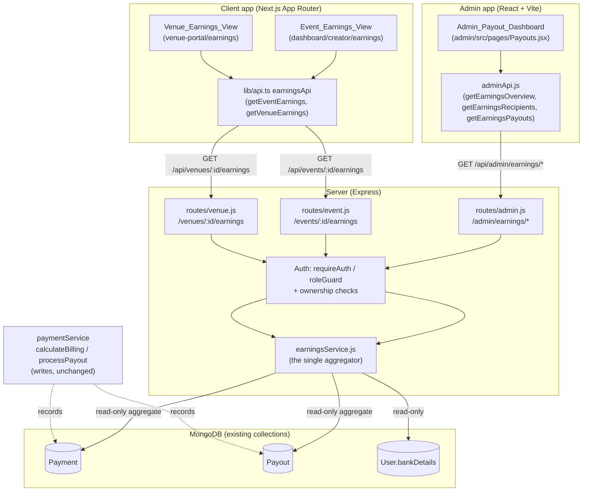
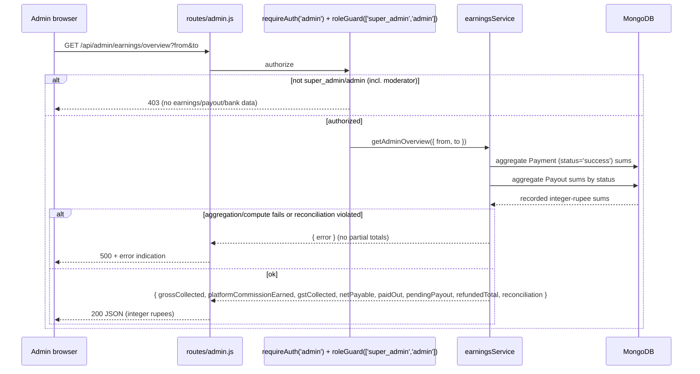

# Design Document

## Overview

This feature adds three read-only financial surfaces — an admin payouts-and-earnings dashboard, an event-organizer earnings view, and a venue-owner earnings view — on top of the money that the platform has **already** computed and recorded. It is a reporting feature, not a billing feature. Its central rule is: **display recorded figures, never recompute money a second way.**

All figures are aggregated by a single new server-side component, `earningsService` (`server/services/earningsService.js`), that reads the recorded `Payment` and `Payout` fields verbatim and sums them. It sits alongside the existing `paymentService` (which owns `calculateBilling` and `processPayout`) and does not duplicate any of that math. The three UI surfaces call thin HTTP routes that delegate to `earningsService`; they hold no money logic of their own.

### Research findings that ground this design

Reading the existing code surfaced several facts the requirements' glossary described in idealized terms. The design is built on the **actual** stored shapes, not the glossary names:

1. **"Paid" is stored as `status: 'success'` on `Payment`.** The `Payment` model's status enum is `['pending', 'processing', 'success', 'failed', 'refunded']`. `paymentService.verifyPayment` sets `status = 'success'` on a verified payment. There is **no** `paymentStatus` field on `Payment`; the `paymentStatus ∈ {pending, paid, refunded, failed}` field the requirements reference lives on the **`Booking`** model. Therefore, wherever the requirements say a Payment is `paid`, this design reads `Payment.status === 'success'`. This mapping is defined once as a constant and reused everywhere (single source of truth for "what counts as collected").

2. **Amounts are stored as integer rupees.** `calculateBilling` and `processPayout` both use `Math.round(...)` on every monetary field, so `Payment.totalAmount`, `platformFee`, `gstAmount`, and `Payout.grossAmount`, `platformCommission`, `netAmount` are already whole rupees. This makes Requirement 9 ("no paise") the natural state and makes "rounded to 2 decimal places" a no-op on already-integer values. No re-rounding is applied on read.

3. **Payment `type` and Payout `type` use different vocabularies.** `Payment.type ∈ {venue_booking, ticket_purchase, ticket}` with `referenceModel ∈ {Booking, Ticket, Event}`; `Payout.type ∈ {venue_booking, event_tickets}` with `referenceModel ∈ {Booking, Event}`. The per-recipient breakdown (Requirement 2) groups by `Payout.type`, so the two sections are literally the two Payout type values.

4. **Bank details live on `User.bankDetails`** (`accountName`, `accountNumber`, `ifscCode`, `bankName`) and are snapshotted onto each `Payout.bankDetails` at payout time. Masking is applied on read.

5. **Access control primitives already exist.** `requireAuth(...roles)` (`server/middleware/auth.js`) attaches the full user doc; `adminAuth = requireAuth('admin')`; `roleGuard([...])` checks `req.user.adminRole` against `['super_admin','admin','moderator']`. Ownership is expressed as `Event.organizer` and `Venue.owner` (both `ObjectId` refs to `User`). The design reuses these rather than inventing new auth.

6. **The frontend API conventions are fixed.** The admin app funnels every call through `adminApi` (`admin/src/api/adminApi.js`) with `authHeaders`/`handle`; the client app funnels through typed helpers in `client/src/lib/api.ts`. New endpoints are added as methods on these existing clients, not as ad-hoc `fetch` calls.

### Design principles

- **One reader, read-only.** `earningsService` is the only place aggregation happens, and none of the three surfaces expose a control that creates, edits, or deletes a `Payment`, `Payout`, or bank record.
- **Verbatim fields.** Aggregates are `$sum` of recorded per-record integer fields. Figures are never re-derived from percentages.
- **Fail closed, no stale totals.** On retrieval/computation failure, or a violated reconciliation identity, the service returns an error indication and the surface shows an error state instead of partial or stale numbers.
- **Reuse over rebuild** (ponytail): reuse `requireAuth`/`roleGuard`, the existing `Payment`/`Payout` queries, `Intl.NumberFormat('en-IN', …)` for Indian grouping, and the existing API clients.

## Architecture



### Request flow (admin overview, representative)



### Placement decisions

- **Backend**: one new service file `server/services/earningsService.js`. Admin endpoints are added to the already-gated `server/routes/admin.js` (the whole router sits behind `adminAuth`). Organizer/owner endpoints are added to `server/routes/event.js` and `server/routes/venue.js` respectively, each behind `requireAuth()` plus a server-side ownership check.
- **Admin surface**: a new page `admin/src/pages/Payouts.jsx` registered in `admin/src/App.jsx` and the sidebar (`AdminDashboardLayout.jsx`), with data access through new `adminApi` methods.
- **Organizer surface**: a new route segment under the existing creator dashboard, `client/src/app/dashboard/creator/earnings/`, reachable per event.
- **Owner surface**: a new route segment under the existing venue portal, `client/src/app/venue-portal/earnings/` (the portal already has an `analytics/` sibling), reachable per venue/booking.
- **Formatting**: one shared INR formatter. On the client it lives in `client/src/lib/` (e.g. `formatInr`); the admin app gets an equivalent tiny helper. Both wrap `Intl.NumberFormat('en-IN', { style: 'currency', currency: 'INR', maximumFractionDigits: 0 })`, so the ₹ symbol, Indian grouping, and integer-rupee display are produced by the platform, not hand-rolled.

## Components and Interfaces

### `earningsService` (server/services/earningsService.js)

The single aggregator. Plain-object module export, matching the existing service style (`paymentService`, `adminService`). All monetary outputs are integer rupees read verbatim from records.

Shared constants (defined once):

```js
const PAID = 'success';                    // Payment.status value that means "collected"
const REFUNDED = 'refunded';               // Payment.status value that means "returned to buyer"
const PENDING_PAYOUT = ['pending', 'processing'];
const COMPLETED_PAYOUT = 'completed';
```

Methods:

- `getAdminOverview({ from, to }) → OverviewDTO`
  Aggregates the six headline figures plus `refundedTotal` and a reconciliation block over all `Payment`/`Payout` records, optionally constrained to an inclusive `createdAt` date range applied identically to every figure. Computes:
  - `grossCollected` = Σ `Payment.totalAmount` where `status = PAID`
  - `gstCollected` = Σ `Payment.gstAmount` where `status = PAID`
  - `platformCommissionEarned` = Σ `Payment.platformFee` where `status = PAID`
  - `netPayable` = `grossCollected − platformCommissionEarned − gstCollected`
  - `paidOut` = Σ `Payout.netAmount` where `status = COMPLETED_PAYOUT`
  - `pendingPayout` = Σ `Payout.netAmount` where `status ∈ PENDING_PAYOUT`
  - `refundedTotal` = Σ `Payment.amount` where `status = REFUNDED`
  - `reconciliation` = `{ grossCollected, platformRetained: platformCommissionEarned + gstCollected, payeeAttributed: netPayable + paidOut, refundedTotal, residual, discrepancy }`

- `getRecipientBreakdown({ from, to }) → { event_tickets: RecipientRow[], venue_booking: RecipientRow[], readyToPayTotal }`
  Groups `Payout` records by `recipient` within each `type` section. Per recipient: `grossEarnings` (Σ gross), `commissionDeducted` (Σ commission), `netPayable` (Σ net), `owedNow` (Σ `netAmount` for `status ∈ PENDING_PAYOUT`, else `0`), and masked `bankDetails` (or `bankDetailsMissing: true`). Recipients with missing bank details are excluded from `readyToPayTotal`.

- `getPayoutList({ statuses }) → PayoutRow[]`
  Returns payouts for lifecycle display, optionally filtered to selected `status` values. Each row exposes `status` (or `unknown` when absent/invalid), `grossAmount`, `platformCommission`, `platformCommissionPercentage`, `netAmount`, `processedAt` (only when `completed`), and `failureReason` (only when `failed`). Flags `refundAfterCompleted: true` when a `refunded` Payment exists for the same reference as a `completed` Payout.

- `getEventEarnings(eventId, requesterId) → EventEarningsDTO`
  Enforces ownership (`Event.organizer === requesterId`) server-side; throws an authorization error otherwise. Returns `grossTicketSales` (Σ `Payment.totalAmount`, `status = PAID`, referencing the event; `0` when none), `platformCommissionDeducted` (Σ `platformFee`), `gst` (Σ `gstAmount`), `netEarnings = gross − commission − gst`, and `payoutStatus` (the referencing Payout's status, or `not yet initiated`).

- `getVenueEarnings(venueId, requesterId) → VenueEarningsDTO`
  Enforces ownership (`Venue.owner === requesterId`) server-side. Returns per-booking rows: `grossBookingAmount`, `advancePaid` (Σ paid `Payment.amount` for the booking), `commissionDeducted`, `netPayable = recognizedGross − commissionDeducted`, `balanceOutstanding` flag when `advancePaid < grossBookingAmount`, and `payoutStatus`. A booking with no paid Payment shows all-zero figures and `not yet initiated`.

- `computePayeeGross(payment) → number` (internal, pure)
  Discount attribution per Requirement 8, mirroring the `processPayout` contract exactly:
  - `discountBearer === 'platform'` → `listedPrice`
  - `discountBearer === 'owner'` → `listedPrice − discountAmount` (reject if `discountAmount` is missing, negative, or `> listedPrice`)
  - `discountBearer === null` → `listedPrice`
  - any other `discountBearer` → excluded with an error indication
  Rounds with the same `Math.round` semantics as `calculateBilling`/`processPayout`.

- `maskAccountNumber(accountNumber) → string` (internal, pure)
  Replaces all but the last four digits with a masking character. Applied to every bank number returned to any surface.

- `formatInr(amount) → string` (shared, pure)
  `₹` + Indian-grouped integer rupees via `Intl.NumberFormat('en-IN', …)`. `null`/`undefined`/absent → `₹0`. Exposed to both server (for any server-rendered string equality) and clients so the same recorded amount renders identically everywhere.

### HTTP routes

| Method & path | Guard | Delegates to |
|---|---|---|
| `GET /api/admin/earnings/overview?from&to` | `adminAuth` + `roleGuard(['super_admin','admin'])` | `getAdminOverview` |
| `GET /api/admin/earnings/recipients?from&to` | `adminAuth` + `roleGuard(['super_admin','admin'])` | `getRecipientBreakdown` |
| `GET /api/admin/earnings/payouts?status=` | `adminAuth` + `roleGuard(['super_admin','admin'])` | `getPayoutList` |
| `GET /api/events/:id/earnings` | `requireAuth()` + ownership | `getEventEarnings` |
| `GET /api/venues/:id/earnings` | `requireAuth()` + ownership | `getVenueEarnings` |

The `roleGuard` treats a legacy admin with no `adminRole` as `super_admin` (existing behavior); a `moderator` fails the guard and is rejected — matching Requirement 11.2. On any auth/authorization rejection the service performs **no writes**, so stored records are unchanged (Requirement 11.6).

### Frontend components

- **Admin_Payout_Dashboard** (`Payouts.jsx`): four regions — headline figures (six cards), reconciliation summary (with residual + discrepancy indicator), per-recipient breakdown (two sections, masked bank details, "bank details missing" badge, read-only), and payout lifecycle list (status filter, `processedAt`/`failureReason`/`unknown` handling, empty-result indication). Uses an optional date-range control that re-queries every figure with the same range.
- **Event_Earnings_View**: a per-event breakdown card (gross / commission / GST / net) plus payout status. Renders within 3s under normal conditions (single aggregate query, indexed).
- **Venue_Earnings_View**: a per-booking table (gross / advance paid / commission / net / balance-outstanding / payout status), scoped to the owner's venues.
- All three share a **loading / empty / error** state machine (see Error Handling): a loading indicator within 300 ms, mutually exclusive with empty and error states; a retry control on error.

## Data Models

No schema changes. This feature is read-only over existing collections. The relevant recorded fields (all monetary fields are integer rupees):

**Payment** (`server/models/Payment.js`)
- `status: 'pending' | 'processing' | 'success' | 'failed' | 'refunded'` — `'success'` = collected/paid, `'refunded'` = returned.
- `type: 'venue_booking' | 'ticket_purchase' | 'ticket'`, `referenceModel: 'Booking' | 'Ticket' | 'Event'`, `referenceId`.
- `amount`, `subtotal`, `platformFee`, `platformFeePercentage`, `gstAmount`, `totalAmount`.
- `discountAmount`, `discountBearer: 'platform' | 'owner' | null`, `listedPrice`.

**Payout** (`server/models/Payout.js`)
- `recipient` (→ `User`), `type: 'venue_booking' | 'event_tickets'`, `referenceModel: 'Booking' | 'Event'`, `referenceId`.
- `grossAmount`, `platformCommission`, `platformCommissionPercentage` (0–100), `netAmount`.
- `bankDetails: { accountName, accountNumber, ifscCode, bankName }` (snapshot).
- `status: 'pending' | 'processing' | 'completed' | 'failed'`, `processedAt`, `failureReason`.

**User** (`server/models/User.js`)
- `bankDetails: { accountName, accountNumber, ifscCode, bankName }` — source of truth for a recipient's bank record; account number masked on read.
- `role`/`roles`/`adminRole` — access control.

**Event** (`Event.organizer`) and **Venue** (`Venue.owner`) provide ownership for the organizer/owner surfaces. **Booking** (`Booking.totalAmount`, `paymentStatus`) provides the full booking amount used to detect an outstanding balance against paid advance Payments.

### Response DTOs (shape returned to surfaces)

```ts
// Admin overview
type OverviewDTO = {
  grossCollected: number; platformCommissionEarned: number; gstCollected: number;
  netPayable: number; paidOut: number; pendingPayout: number; refundedTotal: number;
  reconciliation: {
    grossCollected: number; platformRetained: number; payeeAttributed: number;
    refundedTotal: number; residual: number; discrepancy: boolean;
  };
};

type RecipientRow = {
  recipientId: string; name: string;
  grossEarnings: number; commissionDeducted: number; netPayable: number; owedNow: number;
  bankDetails: { accountName: string; accountNumberMasked: string; ifscCode: string; bankName: string } | null;
  bankDetailsMissing: boolean;
};

type PayoutRow = {
  payoutId: string; status: 'pending'|'processing'|'completed'|'failed'|'unknown';
  grossAmount: number; platformCommission: number; platformCommissionPercentage: number; netAmount: number;
  processedAt?: string; failureReason?: string; refundAfterCompleted?: boolean;
};

type EventEarningsDTO = {
  grossTicketSales: number; platformCommissionDeducted: number; gst: number; netEarnings: number;
  payoutStatus: 'pending'|'processing'|'completed'|'failed'|'not yet initiated';
};

type VenueEarningsDTO = {
  venueId: string;
  bookings: Array<{
    bookingId: string; grossBookingAmount: number; advancePaid: number;
    commissionDeducted: number; netPayable: number; balanceOutstanding: boolean;
    payoutStatus: 'pending'|'processing'|'completed'|'failed'|'not yet initiated';
  }>;
};
```

## Correctness Properties

*A property is a characteristic or behavior that should hold true across all valid executions of a system — essentially, a formal statement about what the system should do. Properties serve as the bridge between human-readable specifications and machine-verifiable correctness guarantees.*

This feature is a strong fit for property-based testing: `earningsService` is pure aggregation and attribution logic over `Payment`/`Payout` records, with universal identities (verbatim sums, reconciliation, discount attribution, masking, INR formatting) that should hold across a large input space. The properties below were derived from the prework analysis, with redundant acceptance criteria consolidated. UI state, rendering presence, performance, and refund-latency criteria are handled by component/integration/smoke tests (see Testing Strategy), not property tests.

### Property 1: Headline aggregates equal the verbatim sum over collected Payments

*For any* set of `Payment` records with mixed `status` values, `Gross_Collected`, `GST_Collected`, and `Platform_Commission_Earned` each equal the exact sum of `totalAmount`, `gstAmount`, and `platformFee` respectively over only the records with `status === 'success'`, and every record whose status is not `'success'` (including `refunded`, `failed`, `pending`, `processing`) contributes `0` to all three; `Total_Refunded_Amount` equals the exact sum of `amount` over records with `status === 'refunded'`. No figure is re-derived from percentages.

**Validates: Requirements 1.2, 1.3, 1.6, 4.2, 7.1, 7.3, 9.4**

### Property 2: Payout aggregates equal the verbatim sum by status

*For any* set of `Payout` records, `Paid_Out` equals the sum of `netAmount` over records with `status === 'completed'`, and `Pending_Payout` equals the sum of `netAmount` over records with `status ∈ {pending, processing}`.

**Validates: Requirements 1.4, 1.5**

### Property 3: Net payable identity

*For any* scope, `Net_Payable` equals `Gross_Collected − Platform_Commission_Earned − GST_Collected`; and for any event or booking scope, `net earnings = gross − commission − GST` (GST omitted where the surface does not deduct it, i.e. `net = gross − commission`).

**Validates: Requirements 1.7, 5.6, 6.3**

### Property 4: Date range applies identically to every figure

*For any* set of dated `Payment`/`Payout` records and any inclusive date range, every displayed figure equals the aggregate computed over exactly the subset of records whose `createdAt` falls within that range; with no range selected, every figure is computed over all records.

**Validates: Requirements 1.8**

### Property 5: Per-recipient breakdown rows are correct, non-negative, and partitioned by type

*For any* set of `Payout` records grouped by recipient, each recipient row satisfies `netPayable = grossEarnings − commissionDeducted` with all monetary values non-negative; `owedNow` equals the sum of `netAmount` over that recipient's payouts with `status ∈ {pending, processing}` (and `0` when none); each recipient appears in exactly one of the two sections matching its `Payout.type` (`event_tickets` or `venue_booking`) and in no other; and `readyToPayTotal` equals the sum of `owedNow` over only those recipients that have valid stored bank details.

**Validates: Requirements 2.1, 2.2, 2.3, 2.4, 2.6**

### Property 6: Account number masking preserves only the last four digits

*For any* account-number string, the masked output preserves the last four characters unchanged, replaces every preceding digit with the masking character, and preserves the overall length; this masking is applied to every account number returned to any surface.

**Validates: Requirements 2.5, 11.5**

### Property 7: Payout lifecycle fields follow status

*For any* `Payout`, the displayed status is exactly one of `pending`, `processing`, `completed`, `failed`, or `unknown` (when the stored status is absent or not a valid value); a `completed` payout exposes `processedAt`; a `failed` payout exposes `failureReason` and omits `processedAt`; and an `unknown`-status payout still exposes its remaining fields.

**Validates: Requirements 3.1, 3.3, 3.4, 3.5**

### Property 8: Payout status filter returns exactly the matching subset

*For any* set of `Payout` records and any selection of status values, the returned list contains exactly those payouts whose `status` is in the selection — every matching payout is included and no non-matching payout is included (an empty selection-match yields an empty list).

**Validates: Requirements 3.6, 3.7**

### Property 9: Reconciliation identity, residual, and discrepancy flag

*For any* matched set of `Payment` and `Payout` records for a scope, each `Payment` is attributed to exactly one reconciliation category (platform-retained, payee-attributed, or refunded) with no double counting; the `residual` equals `Gross_Collected − (platformRetained + payeeAttributed + refundedTotal)`; the discrepancy flag is `true` if and only if `|residual| > 0.01`; the category totals are identical whether or not the flag is set; and when the identity is violated the scope is flagged and an error indication is returned with records left unchanged.

**Validates: Requirements 4.3, 4.4, 4.5, 10.3, 10.5**

### Property 10: Scoped gross equals the sum of paid amounts for that reference

*For any* set of `Payment` records spread across multiple events/bookings, an event's gross ticket sales equals the sum of `totalAmount` over that event's `status === 'success'` payments (and `0` when none), and a booking's recognized gross equals the sum of `amount` over that booking's `status === 'success'` payments (and `0` when none).

**Validates: Requirements 5.2, 6.2**

### Property 11: Payout status for a reference, or "not yet initiated"

*For any* event or booking, the displayed payout status equals the status of the `Payout` record referencing it when such a record exists, and equals `not yet initiated` when no referencing `Payout` exists.

**Validates: Requirements 5.3, 5.4, 6.5, 6.6**

### Property 12: Outstanding balance detection

*For any* booking, the `balanceOutstanding` indicator is `true` if and only if the total paid amount is greater than `0` and strictly less than the full gross booking amount; in that case the displayed advance equals the total paid amount.

**Validates: Requirements 6.4**

### Property 13: Payee gross discount attribution

*For any* `Payment` with a valid `discountBearer`, the computed payee gross equals: `listedPrice` when `discountBearer === 'platform'`, `listedPrice − discountAmount` when `discountBearer === 'owner'` (with a valid discount), and `listedPrice` when `discountBearer === null`; the platform-side gross always equals the full `listedPrice` regardless of `discountBearer`; and every computed payee gross equals `Math.round(...)` under the same rounding operation used by `calculateBilling`/`processPayout`.

**Validates: Requirements 8.1, 8.2, 8.3, 8.4, 8.5**

### Property 14: Invalid discount input is excluded without corrupting earnings

*For any* `Payment` where `discountBearer === 'owner'` and `discountAmount` is negative, greater than `listedPrice`, or missing, or where `discountBearer` is any value other than `platform`, `owner`, or `null`, that `Payment` is excluded from the payee's accumulated gross, an error indication identifying the invalid field is returned, the computed gross is never negative, and previously accumulated earnings are unchanged.

**Validates: Requirements 8.6, 8.7**

### Property 15: INR formatting is consistent, grouped, integer-rupee, and safe on null

*For any* integer rupee amount, `formatInr` produces a string prefixed with `₹`, grouped using the Indian numbering system (thousands, lakhs, crores), with no fractional/paise portion, equal to the output of `Intl.NumberFormat('en-IN', …)` for that amount; the function is deterministic, so equal inputs always produce identical strings (hence identical across every surface); and an absent, `null`, or `undefined` amount produces `₹0` rather than a blank, error, or non-numeric value.

**Validates: Requirements 9.1, 9.2, 9.5**

### Property 16: Displayed figures are read verbatim from recorded fields

*For any* `Payment` or `Payout` record, each displayed breakdown figure equals the corresponding recorded field exactly — `grossAmount`, `platformCommission`, `platformCommissionPercentage`, `netAmount` from `Payout`, and `totalAmount`, `platformFee`, `gstAmount`, `netAmount` from `Payment` — with no arithmetic re-derivation, so the displayed value equals the recorded integer-rupee value with zero rupee difference.

**Validates: Requirements 9.3, 10.1**

### Property 17: Refund-after-completed reconciliation flag

*For any* set of `Payment` and `Payout` records, the `refundAfterCompleted` flag is set for a `Payout` if and only if that `Payout` has `status === 'completed'` and a `Payment` with `status === 'refunded'` exists for the same reference; when set, the completed `Payout` record is returned unchanged.

**Validates: Requirements 7.5**

### Property 18: Earnings surfaces enforce ownership and role, returning no data when unauthorized

*For any* requester, a request to the admin dashboard is rejected with an authorization error and returns no earnings/payout/bank data unless the requester is authenticated with `adminRole ∈ {super_admin, admin}` (a `moderator` is always rejected); an event earnings request is rejected unless the requester's id equals `Event.organizer`; and a venue earnings request is rejected unless the requester's id equals `Venue.owner`. In every rejection case, no earnings data for the unauthorized scope is returned.

**Validates: Requirements 5.5, 6.7, 6.8, 11.1, 11.2, 11.3, 11.4**

## Error Handling

The surfaces distinguish three terminal states — **loading**, **empty**, and **error** — and these are mutually exclusive at all times (Requirement 12). The service fails closed: it never returns partial, stale, or unreconciled totals.

### Service-level (earningsService)

- **Retrieval/computation failure** (DB error, aggregation throws): the method rejects with an error object; it does **not** return a partial DTO. Callers surface this as an error state. (Requirements 1.9, 6.9)
- **Missing/null required source field on a completed Payment**: the affected figure is suppressed and an error indication naming the scope is returned; recorded values are preserved and not written. (Requirement 10.4)
- **Reconciliation identity violated** (`|residual| > 0.01`): the scope is flagged; the overview still returns the category totals (unchanged) together with the `discrepancy` flag so the admin sees the mismatch rather than a hidden or "corrected" number. When a scope-level violation prevents a trustworthy figure, an error indication is returned and records are preserved. (Requirements 4.5, 10.5)
- **Invalid discount attribution** (`Property 14`): the offending Payment is excluded from the payee's gross and an error indication identifies the invalid `discountAmount`/`discountBearer`; accumulated earnings are unchanged and never negative. (Requirements 8.6, 8.7)
- **Authorization failure**: reject before any read of financial data; return no earnings/payout/bank data; perform no writes. (Requirements 11.1, 11.6)

### Route-level

- Unauthorized (missing/invalid token) → `401`; wrong role/ownership → `403`; server/compute failure → `500` with an `{ error }` body. These mirror the existing admin/route error style (`res.status(...).json({ error })`) and the `adminApi.handle` / `client api.ts` handling that maps `401/403` to a re-auth flow.

### Surface-level (all three views)

- A loading indicator appears within 300 ms of initiating retrieval and is never shown alongside the empty or error state. (Requirement 12.1)
- A successful response with zero records renders an empty-state message identifying the scope. (Requirement 12.2)
- A failed response, or one exceeding a 30 s ceiling, renders an error message plus a retry control. (Requirement 12.3)
- Activating retry re-initiates retrieval for the same scope and returns to the loading state. (Requirement 12.4)
- Any absent/null monetary value renders as `₹0`. (Requirement 9.5)

## Testing Strategy

Property-based testing applies to the `earningsService` logic layer; example, component, integration, and smoke tests cover UI, wiring, and non-logic criteria. This dual approach mirrors the existing `server/__tests__` conventions.

### Tooling

- **Property + unit (server logic)**: `vitest` + `fast-check` (already dependencies) with `mongodb-memory-server` for record-backed aggregation tests, matching the existing `*.property.test.ts` files (e.g. `discountBearer.property.test.ts`, `moneyInvariant.preservation.property.test.ts`).
- **Component (surfaces)**: the client already uses component tests (e.g. `BillingCard.test.tsx`); the three views' loading/empty/error/retry state machines and rendering presence are covered here.
- **Integration (routes + auth)**: `supertest` against the Express routes (pattern from `inquiryConversation.property.test.ts`) to verify guards and read-only behavior.

### Property tests

- Implement **each** of Properties 1–18 as a **single** property-based test.
- Minimum **100 iterations** per property (fast-check default `numRuns` ≥ 100).
- Generators produce mixed-status `Payment` sets (including `pending`, `processing`, `success`, `failed`, `refunded`), mixed-status `Payout` sets, varied `discountBearer`/`discountAmount`/`listedPrice` (including invalid combinations for Property 14), account-number strings of varied length (Property 6), integer rupee amounts including `0`, large values (lakhs/crores), and `null`/`undefined` (Property 15), and multiple owners/requesters (Property 18). Edge cases (empty scopes, no-payout references, absent status/fields) are folded into these generators.
- Each test carries a tag comment referencing its design property, in the form:
  **Feature: payout-earnings-breakdown, Property {number}: {property_text}**
- Do not re-implement a PBT framework; use `fast-check`.

### Example / unit tests

- Rendering presence: six headline figures (1.1), four reconciliation figures (4.1), the four payout fields (3.2), event four-figure card (5.1), venue per-booking columns (6.1).
- Read-only guarantees: no mutation controls in any surface and earnings endpoints are GET-only (2.7); rejected requests perform no writes (10.2, 11.6).
- Moderator UI hiding (11.2 UI half).

### Component tests (state machine)

- Loading within 300 ms and mutual exclusion with empty/error (12.1); empty-state on zero records (12.2); error + retry on failure/timeout (12.3); retry re-fetches same scope and returns to loading (12.4).

### Integration tests

- Route guards: `super_admin`/`admin` allowed, `moderator`/unauthenticated/other roles rejected on `/admin/earnings/*`; event/venue ownership enforced on `/events/:id/earnings` and `/venues/:id/earnings` (complements Property 18 at the HTTP layer).
- Refund exclusion after a status transition to `refunded` (7.2) — verify a recompute excludes the refunded amount.

### Smoke test

- Event earnings breakdown renders within 3 s under a normal-volume dataset (5.7), run once (not iterated).
