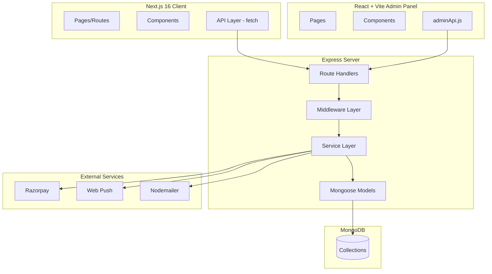

# Design Document: Platform Feature Overhaul

## Overview

This design covers the implementation of 19 requirements across 7 domains for the Firaa event/venue platform. The changes span the entire stack: Express + MongoDB server (business logic, data models, APIs), React + Vite admin panel (admin features, audit), and Next.js 16 client (public-facing UI, ticketing, billing).

The overhaul introduces:
- **Admin Panel**: Featured events toggle, mobile sidebar fix, role-based access with audit trail, completed events listing
- **Ticketing**: Custom ticket tiers, cancellation removal, iOS download fix, scanning links with access codes
- **Billing & Payments**: Tax/fee breakdown card, discount/redeem code system
- **Creator Ecosystem**: Duplicate account fix, self-follow bug fix, bank details for payouts
- **Venues**: Review eligibility restrictions, time-based cancellation policies
- **Notifications**: Event update notifications with batching
- **Client UI**: Contact Us cleanup, completed events in public listing, inquiry via reference link

### Design Principles

1. **Additive schema changes** — new fields default to `null`/`false` to preserve backward compatibility with existing documents
2. **Atomic operations** — use MongoDB `$inc` and `findOneAndUpdate` for concurrent-safe updates (ticket sales, follower counts)
3. **Middleware-based authorization** — extend existing `adminAuth.js` with role checks rather than adding new middleware
4. **Service layer isolation** — all business logic lives in `services/`, routes remain thin wrappers
5. **Existing library reuse** — Zod for validation, existing `notificationService` for notifications, Razorpay SDK for payments

---

## Architecture



### Key Architectural Decisions

| Decision | Rationale |
|----------|-----------|
| Extend existing `User.role` with `adminRole` field | Keeps existing role system intact; `adminRole` is orthogonal to user/venue_owner/admin distinction |
| New `AuditLog` model instead of embedded logs | Audit entries grow unbounded; separate collection allows efficient pagination and filtering |
| `ticketTiers` as embedded array on Event | Tiers are always accessed with their event; no cross-event tier queries needed |
| `DiscountCode` as separate model | Codes need independent lifecycle (CRUD, analytics), not tied to event document lifecycle |
| `ScanningCode` as separate model | Codes have their own activation/deactivation lifecycle independent of event |
| `Inquiry` as new model | Decoupled from Booking/Ticket; different lifecycle and notification path |
| Batch notifications via `node-cron` job pattern | Reuses existing `scheduledJobs.js` infrastructure for batch processing |

---

## Components and Interfaces

### Server — New Route Files

| Route File | Endpoints | Auth |
|------------|-----------|------|
| `routes/admin.js` (extend) | `PATCH /admin/events/:id/featured`, `GET /admin/audit-trail` | `adminAuth` + role check |
| `routes/ticket.js` (extend) | `POST /tickets/:id/cancel` (restrict to admin) | `auth` + admin check |
| `routes/event.js` (extend) | `POST /events/:id/scanning-codes`, `GET /scan/:code` | `auth` / public |
| `routes/payment.js` (extend) | `POST /payments/apply-discount` | `auth` |
| `routes/venue.js` (extend) | `POST /venues/:id/reviews`, `PATCH /venues/:id/cancellation-policy` | `auth` / `venueOwnerAuth` |
| `routes/inquiry.js` (new) | `POST /inquiries`, `GET /inquiries/:id` | public / `auth` |
| `routes/discount.js` (new) | CRUD for discount codes | `auth` (organizer) / `adminAuth` |

### Server — New/Modified Services

| Service | Responsibility |
|---------|---------------|
| `adminService.js` (extend) | Featured toggle, audit trail queries |
| `ticketService.js` (extend) | Tier-based purchase validation, atomic `soldCount` increment |
| `eventService.js` (extend) | Scanning code CRUD, event update notification trigger |
| `paymentService.js` (extend) | Billing calculation with GST, discount application |
| `discountService.js` (new) | Discount code CRUD, validation, analytics |
| `venueService.js` (extend) | Review eligibility check, cancellation policy enforcement |
| `verificationService.js` (extend) | Duplicate account prevention on creator approval |
| `userService.js` (extend) | Self-follow prevention, bank details validation |
| `inquiryService.js` (new) | Inquiry creation, rate limiting, reference validation |
| `notificationService.js` (extend) | Event update notifications with batching |

### Server — New Middleware

| Middleware | Purpose |
|------------|---------|
| `roleGuard(allowedRoles)` | Higher-order middleware returning role checker; extends `adminAuth.js` |

### Admin Panel — New/Modified Pages

| Page | Changes |
|------|---------|
| `EventDetail.jsx` | Add featured toggle, ticket tiers display |
| `Events.jsx` | Add completed status to filter, status badges |
| `AdminDashboardLayout.jsx` | Fix hamburger toggle, add role-based nav item visibility |
| `AuditTrail.jsx` (new) | Paginated audit log viewer with filters |
| `DiscountCodes.jsx` (new) | Discount code management and analytics |

### Client — New/Modified Pages

| Page | Changes |
|------|---------|
| Event creation page | Ticket tiers form (1-10 tiers) |
| Event detail page | Billing card, scanning link generation, inquiry button |
| Tickets page | Remove cancel button, iOS download fix |
| Events listing | Completed events section, status badges |
| Creator dashboard | Bank details form |
| Venue page | Cancellation policy display, review form (conditional) |
| Contact Us page | Remove phone/address, keep only email |
| Inquiry page (new) | Inquiry form with reference pre-fill |

---

## Data Models

### New Models

#### AuditLog

```javascript
const auditLogSchema = new mongoose.Schema({
  adminUser: { type: ObjectId, ref: 'User', required: true },
  action: { type: String, enum: ['approve', 'reject', 'block', 'unblock', 'feature', 'unfeature'], required: true },
  entityType: { type: String, enum: ['event', 'venue', 'creator', 'user'], required: true },
  entityId: { type: ObjectId, required: true },
  metadata: { type: Mixed, default: {} }, // e.g., rejectionReason
  timestamp: { type: Date, default: Date.now }
});
auditLogSchema.index({ entityType: 1, action: 1 });
auditLogSchema.index({ adminUser: 1 });
auditLogSchema.index({ timestamp: -1 });
```

#### DiscountCode

```javascript
const discountCodeSchema = new mongoose.Schema({
  event: { type: ObjectId, ref: 'Event', required: true },
  code: { type: String, required: true, uppercase: true, minlength: 3, maxlength: 20 },
  discountType: { type: String, enum: ['percentage', 'flat'], required: true },
  discountValue: { type: Number, required: true },
  maxUses: { type: Number, default: null }, // null = unlimited
  usedCount: { type: Number, default: 0 },
  validFrom: { type: Date, required: true },
  validUntil: { type: Date, required: true },
  isActive: { type: Boolean, default: true },
  createdBy: { type: ObjectId, ref: 'User', required: true },
  activatedBy: { type: ObjectId, ref: 'User', default: null }
}, { timestamps: true });
discountCodeSchema.index({ event: 1, code: 1 }, { unique: true });
discountCodeSchema.index({ code: 1 });
```

#### ScanningCode

```javascript
const scanningCodeSchema = new mongoose.Schema({
  event: { type: ObjectId, ref: 'Event', required: true },
  code: { type: String, required: true, unique: true, length: 12 },
  label: { type: String, maxlength: 50, default: '' },
  createdBy: { type: ObjectId, ref: 'User', required: true },
  isActive: { type: Boolean, default: true },
  createdAt: { type: Date, default: Date.now }
});
scanningCodeSchema.index({ event: 1 });
scanningCodeSchema.index({ code: 1 }, { unique: true });
```

#### Inquiry

```javascript
const inquirySchema = new mongoose.Schema({
  referenceType: { type: String, enum: ['event', 'venue'], required: true },
  referenceId: { type: ObjectId, required: true },
  senderName: { type: String, required: true, maxlength: 100 },
  senderEmail: { type: String, required: true, maxlength: 254 },
  senderPhone: { type: String, maxlength: 20, default: null },
  message: { type: String, required: true, minlength: 10, maxlength: 2000 },
  status: { type: String, enum: ['pending', 'responded', 'closed'], default: 'pending' },
  user: { type: ObjectId, ref: 'User', default: null } // if authenticated
}, { timestamps: true });
inquirySchema.index({ referenceId: 1, senderEmail: 1, createdAt: -1 });
inquirySchema.index({ referenceType: 1, status: 1 });
```

#### VenueReview

```javascript
const venueReviewSchema = new mongoose.Schema({
  user: { type: ObjectId, ref: 'User', required: true },
  venue: { type: ObjectId, ref: 'Venue', required: true },
  rating: { type: Number, required: true, min: 1, max: 5 },
  comment: { type: String, maxlength: 1000, default: '' }
}, { timestamps: true });
venueReviewSchema.index({ user: 1, venue: 1 }, { unique: true }); // one review per user per venue
venueReviewSchema.index({ venue: 1, createdAt: -1 });
```

### Modified Models

#### User — Add `adminRole` field

```javascript
adminRole: {
  type: String,
  enum: ['super_admin', 'admin', 'moderator'],
  default: null // null for non-admin users
}
```

#### Event — Add `ticketTiers` array

```javascript
ticketTiers: [{
  name: { type: String, required: true, trim: true, maxlength: 50 },
  price: { type: Number, required: true, min: 0 },
  description: { type: String, maxlength: 200, default: '' },
  maxQuantity: { type: Number, required: true, min: 1 },
  soldCount: { type: Number, default: 0 }
}]
```

#### Payment — Add billing breakdown fields

```javascript
subtotal: { type: Number, default: 0 },
gstAmount: { type: Number, default: 0 },
totalAmount: { type: Number, default: 0 },
discountCode: { type: String, default: null },
discountAmount: { type: Number, default: 0 }
```

#### Ticket — Change `ticketType` from enum to String

```javascript
ticketType: { type: String, default: 'general' }, // was: enum ['general', 'vip', 'early_bird']
checkedInBy: { type: String, default: null } // now stores access code ID or user ID
```

#### Venue — Add `cancellationPolicy` sub-document

```javascript
cancellationPolicy: {
  freeCancellationHours: { type: Number, min: 1, max: 720, default: 48 },
  partialRefundPercentage: { type: Number, min: 0, max: 100, default: 50 },
  noCancellationHours: { type: Number, min: 0, max: 720, default: 24 }
}
```

#### Notification — Add `event_update` to type enum

```javascript
// Add to existing enum array:
'event_update'
```

---

## Correctness Properties

*A property is a characteristic or behavior that should hold true across all valid executions of a system — essentially, a formal statement about what the system should do. Properties serve as the bridge between human-readable specifications and machine-verifiable correctness guarantees.*

### Property 1: Featured Events Filter Correctness

*For any* set of events in the database, the featured events API response SHALL contain only events where `isFeatured === true` AND `status` is in `['approved', 'upcoming']`, ordered by `startDateTime` ascending, with a maximum of 10 results.

**Validates: Requirements 1.4, 1.5**

### Property 2: Role-Based Access Enforcement

*For any* admin user with a given `adminRole`, attempting an action outside their permitted set SHALL result in a 403 response; specifically, moderators SHALL be denied access to user block/unblock, payments, and role management, and only `super_admin` SHALL be able to modify `adminRole` on other users.

**Validates: Requirements 3.3, 3.4, 3.7, 3.8**

### Property 3: Audit Trail Completeness

*For any* admin approval or rejection action on an event, venue, or creator, an AuditLog document SHALL exist with matching `adminUser`, `entityId`, `action`, `entityType`, and `timestamp` within 1 second of the action.

**Validates: Requirements 3.5**

### Property 4: Ticket Tier Quantity Invariant

*For any* event with `ticketTiers`, each tier's `soldCount` SHALL be less than or equal to its `maxQuantity`, and a purchase attempt on a tier where `soldCount >= maxQuantity` SHALL be rejected. Additionally, duplicate tier names within a single event SHALL be rejected on creation.

**Validates: Requirements 5.4, 5.7**

### Property 5: Non-Admin Ticket Cancellation Prohibition

*For any* non-admin authenticated user, a POST request to `/api/tickets/:id/cancel` SHALL return HTTP 403.

**Validates: Requirements 6.3**

### Property 6: Scanning Code Event-Ticket Match Invariant

*For any* scan attempt using an access code, the ticket's `event` field must equal the access code's `event` field for the scan to succeed; mismatched pairs SHALL be rejected, and successful scans SHALL record the access code identifier in `checkedInBy`.

**Validates: Requirements 8.4, 8.7, 8.8**

### Property 7: Payment Calculation Consistency

*For any* ticket purchase with a given `ticketPrice`, `quantity`, and `platformFeePercentage`, the stored payment SHALL satisfy: `subtotal = ticketPrice × quantity`, `platformFee = Math.round(subtotal × platformFeePercentage / 100)`, `gstAmount = Math.round(platformFee × 0.18)`, and `totalAmount = subtotal + platformFee + gstAmount`.

**Validates: Requirements 9.2**

### Property 8: Discount Application Calculation

*For any* valid discount code applied to a purchase, the discount SHALL be applied to the subtotal first (capped at subtotal for flat discounts), then `platformFee` and `gstAmount` SHALL be computed on the discounted subtotal. Only one discount code SHALL be applicable per transaction.

**Validates: Requirements 10.3, 10.5, 10.9**

### Property 9: Discount Code Validity Enforcement

*For any* discount code where `usedCount >= maxUses` OR current date is outside `[validFrom, validUntil]` OR `isActive === false`, the server SHALL reject the code with an error message indicating the specific reason.

**Validates: Requirements 10.6**

### Property 10: Single Email Single Account Invariant

*For any* creator application, if a User document already exists with the applicant's email (case-insensitive), the system SHALL update that existing User document and SHALL NOT create a new User document.

**Validates: Requirements 11.1, 11.2, 11.3, 11.4**

### Property 11: Self-Follow Invariant

*For any* user, their own `_id` SHALL NOT appear in their `followers` or `following` arrays, and any follow request where `userId === targetId` SHALL be rejected.

**Validates: Requirements 12.1, 12.3, 12.4**

### Property 12: Bank Details Validation

*For any* submitted bank details, the IFSC code SHALL match the pattern `/^[A-Z]{4}0[A-Z0-9]{6}$/` and the account number SHALL contain only digits with length between 9 and 18 characters. Invalid submissions SHALL be rejected without updating stored data.

**Validates: Requirements 13.2**

### Property 13: Venue Review Eligibility

*For any* venue review submission, a Booking document SHALL exist with the reviewer's `user` ID, the venue's `_id`, and `status === 'completed'`. Additionally, only one review per user-venue pair SHALL be permitted.

**Validates: Requirements 14.1, 14.4**

### Property 14: Venue Rating Recalculation

*For any* new venue review with rating `r`, if the venue previously had `rating.average = a` and `rating.count = c`, the new average SHALL equal `(a * c + r) / (c + 1)` and count SHALL equal `c + 1`.

**Validates: Requirements 14.5**

### Property 15: Cancellation Policy Tier Application

*For any* booking cancellation request, given `hoursRemaining` (from now to booking start), the policy tier applied SHALL be: full refund if `hoursRemaining > freeCancellationHours`, partial refund at `partialRefundPercentage` if `noCancellationHours < hoursRemaining <= freeCancellationHours`, or rejection if `hoursRemaining <= noCancellationHours`. The constraint `noCancellationHours < freeCancellationHours` SHALL be enforced on policy creation.

**Validates: Requirements 15.3, 15.4, 15.5, 15.6, 15.8**

### Property 16: Event Update Notification Correctness

*For any* event update to fields `[name, startDateTime, endDateTime, venue, description]`, notifications SHALL be created for all users holding tickets with `status === 'active'` for that event. No notifications SHALL be created for admin-triggered status transitions.

**Validates: Requirements 16.1, 16.4**

### Property 17: Completed Events Listing Separation

*For any* events API response with `includeCompleted=true`, the `completedEvents` array SHALL contain only events with `status === 'completed'`, sorted by `endDateTime` descending, capped at 20 items. Without this parameter, no completed events SHALL appear.

**Validates: Requirements 18.1, 18.4, 18.5**

### Property 18: Inquiry Rate Limiting

*For any* `senderEmail` and `referenceId` combination, the system SHALL reject the 6th inquiry submission within a 24-hour window.

**Validates: Requirements 19.6**

### Property 19: Inquiry Reference Validation

*For any* inquiry submission, if the referenced event has a status other than `['upcoming', 'approved', 'ongoing']` or the referenced venue has a status other than `'approved'`, the submission SHALL be rejected.

**Validates: Requirements 19.5**

---

## Error Handling

### Server-Side Error Strategy

| Scenario | HTTP Status | Error Shape |
|----------|-------------|-------------|
| Unauthorized role action | 403 | `{ error: "Insufficient permissions for this action" }` |
| Feature invalid-status event | 400 | `{ error: "Event must be in approved or upcoming status to be featured" }` |
| Ticket tier sold out | 400 | `{ error: "Tier '{name}' is sold out" }` |
| Duplicate tier name | 400 | `{ error: "Duplicate tier names are not allowed" }` |
| Non-admin cancel ticket | 403 | `{ error: "Ticket cancellation is not available for non-admin users" }` |
| Invalid scanning code | 400 | `{ error: "Access code is invalid" }` |
| Deactivated scanning code | 403 | `{ error: "Access code has been deactivated" }` |
| Ticket-event mismatch on scan | 400 | `{ error: "Ticket belongs to a different event" }` |
| Invalid/expired discount code | 400 | `{ error: "Discount code expired/limit reached/deactivated" }` |
| Self-follow attempt | 400 | `{ error: "A user cannot follow themselves" }` |
| Bank details validation failure | 400 | `{ error: "Invalid IFSC code format", field: "ifscCode" }` |
| No completed booking for review | 403 | `{ error: "You must complete a booking before reviewing" }` |
| Duplicate review | 409 | `{ error: "A review has already been submitted for this venue" }` |
| Cancellation window passed | 400 | `{ error: "Cancellation window has passed" }` |
| Inquiry rate limit exceeded | 429 | `{ error: "Rate limit exceeded. Maximum 5 inquiries per 24 hours" }` |
| Invalid inquiry reference | 400 | `{ error: "Reference is unavailable" }` |
| Creator duplicate account (partial failure) | 500 | `{ error: "Application processing failed: {reason}" }` — with rollback |

### Client-Side Error Handling

- All API calls wrapped in try/catch with user-facing toast notifications
- Optimistic UI updates (featured toggle) revert on failure
- Form validation errors displayed inline per field (Zod schema validation on client mirrors server)
- iOS download fallback chain: primary method → Web Share API → blob URL → inline error message

### Atomicity and Consistency

- **Ticket purchase**: Use `findOneAndUpdate` with `$inc: { soldCount: 1 }` and filter `soldCount: { $lt: maxQuantity }` for atomic concurrent-safe increment
- **Creator application**: Wrap lookup + update in a try/catch; if any step fails, do not commit partial changes (no MongoDB transaction needed since operations target single documents)
- **Notification batching**: Process in chunks of 500; log failures per batch without blocking subsequent batches or the event update response
- **Discount code usage**: Atomic `$inc: { usedCount: 1 }` with filter `usedCount: { $lt: maxUses }` to prevent race conditions

---

## Testing Strategy

### Testing Framework

- **Server**: Vitest + `fast-check` (already installed), `mongodb-memory-server` for integration, `supertest` for HTTP
- **Client**: Vitest + `@testing-library/react` + `fast-check` (already installed)
- **Admin**: No test runner currently; add Vitest if needed for critical logic

### Property-Based Tests (fast-check)

Each correctness property maps to a property-based test with minimum 100 iterations:

| Property | Test File | What's Generated |
|----------|-----------|------------------|
| P1: Featured filter | `server/__tests__/unit/featuredEvents.prop.test.ts` | Random event arrays with varying isFeatured/status |
| P2: Role-based access | `server/__tests__/unit/roleAccess.prop.test.ts` | Random role + endpoint combinations |
| P4: Tier quantity invariant | `server/__tests__/unit/ticketTiers.prop.test.ts` | Random tier configs, concurrent purchase sequences |
| P5: Non-admin cancel | `server/__tests__/unit/ticketCancel.prop.test.ts` | Random non-admin users |
| P6: Scan event match | `server/__tests__/unit/scanningCodes.prop.test.ts` | Random ticket/code/event combinations |
| P7: Payment calculation | `server/__tests__/unit/paymentCalc.prop.test.ts` | Random prices, quantities, fee percentages |
| P8: Discount calculation | `server/__tests__/unit/discountCalc.prop.test.ts` | Random subtotals, discount types/values |
| P9: Discount validity | `server/__tests__/unit/discountValidity.prop.test.ts` | Random code states (expired, maxed, inactive) |
| P10: Single email account | `server/__tests__/unit/creatorApplication.prop.test.ts` | Random emails, existing/new users |
| P11: Self-follow | `server/__tests__/unit/selfFollow.prop.test.ts` | Random user IDs |
| P12: Bank validation | `server/__tests__/unit/bankDetails.prop.test.ts` | Random IFSC codes, account numbers |
| P13: Review eligibility | `server/__tests__/unit/venueReview.prop.test.ts` | Random user-venue-booking combinations |
| P14: Rating recalculation | `server/__tests__/unit/venueRating.prop.test.ts` | Random existing ratings + new review ratings |
| P15: Cancellation tiers | `server/__tests__/unit/cancellationPolicy.prop.test.ts` | Random booking times, policy configs, cancellation times |
| P16: Event update notify | `server/__tests__/unit/eventUpdateNotify.prop.test.ts` | Random field updates, ticket holder sets |
| P17: Completed events listing | `server/__tests__/unit/completedEvents.prop.test.ts` | Random event arrays with varying statuses |
| P18: Inquiry rate limit | `server/__tests__/unit/inquiryRateLimit.prop.test.ts` | Random inquiry sequences per email/reference |
| P19: Inquiry reference | `server/__tests__/unit/inquiryReference.prop.test.ts` | Random reference IDs/statuses |

**Tag format**: Each property test is tagged with a comment:
```javascript
// Feature: platform-feature-overhaul, Property N: <property text>
```

**Configuration**: Minimum 100 iterations per property (`fc.assert(property, { numRuns: 100 })`).

### Unit Tests (Example-Based)

| Domain | Coverage |
|--------|----------|
| Admin sidebar toggle | Open/close state transitions, single hamburger in DOM |
| Featured toggle optimistic UI | Success path + revert on failure |
| iOS ticket download | Image generation, fallback chain |
| Billing card rendering | INR formatting, free event skip |
| Contact Us page | Email only, no phone/address |
| Discount code CRUD | Create, edit, deactivate flows |

### Integration Tests

| Test | Method |
|------|--------|
| Admin audit trail API | `supertest` + `mongodb-memory-server` |
| Ticket purchase with tier validation | End-to-end purchase flow |
| Scanning code creation and usage | Create code, scan ticket, verify check-in |
| Notification batch processing | >1000 ticket holders, verify batching |
| Inquiry submission with notification | Submit + verify Inquiry persisted even on notification failure |

### Test Balance

- **Property tests handle**: input validation, calculation correctness, invariant enforcement, filtering logic
- **Unit tests handle**: specific UI states, rendering, component behavior, integration seams
- **Integration tests handle**: full API flows, database interactions, external service mocking
